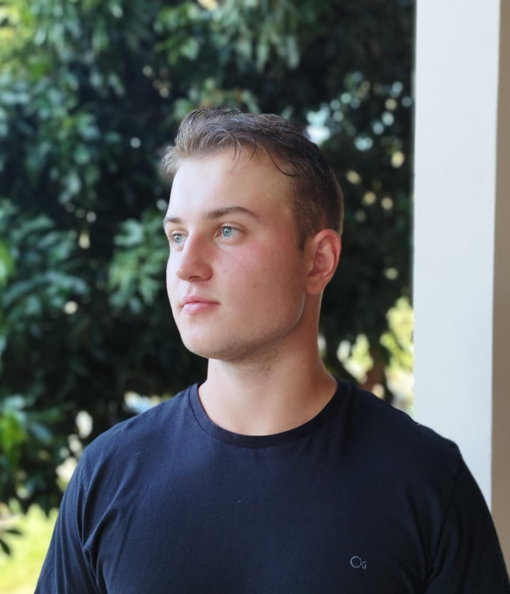

# Oi, eu sou Raiel Babinski! 

  

## 📣 Apresentação 

- 🌍 **Localização**: Nova Erechim - SC - Brasil.  
- 🎓 **Universidade**: Universidade Federal da Fronteira Sul.  
- 💻 **Curso**: Ciência da Computação.  
- 📚 **Semestre Atual**: Quarto semestre.   
- 🛠️ **Conhecimentos**: Python, C, Java, GIT/GitHub, SQL.  
- 🎮 **Hobbies**: Jogar jogos indie, ir à academia e treinar Jiu Jitsu.  

## 👨‍💻 Sobre Mim

Sempre fui apaixonado por jogos eletrônicos desde a infância, o que despertou meu interesse por computadores e tecnologia. Com 18 anos, decidi ingressar no curso de Ciência da Computação. Agora, vivendo minha primeira experiência no mercado de trabalho, isso me deixa muito motivado e entusiasmado com as oportunidades para o futuro.

## 🏆 Sprints

1. [Sprint 1](/Sprint%201//README.md)  
2. [Sprint 2](/Sprint%202//README.md)  

---

