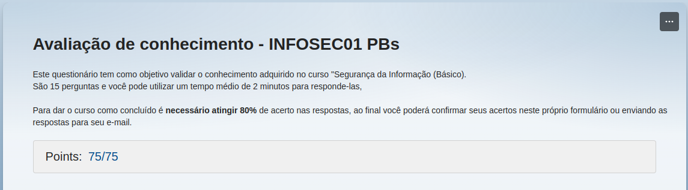

# Instruções

Este arquivo será o relato da sua entrega. Neste arquivo você fará a organização geral ao longo da Sprint. Esperamos que haja, minimamente:

- Uma ou mais seções para descrever o que estiver aprendendo (resumo), de maneira estruturada.

- Breve conteúdo de cada pasta relacionada a sprint.

# Resumo

**Fundamentos da Segurança da Informação:** Nesse curso aprendi conceitos básicos para ter boas práticas em relação a Segurança da Informação.

**Git e GitHub:** Nesse curso aprendi como manipular versionamento no git, e como me conectar os repositorios locais usando github

**Sql:** Aprendi isso, isso e mais aquilo.

**Modelagem Relacional e Dimensional:** Pude entender como funciona isso e aquilo.

# Exercícios

1. ...
[Resposta Ex1.](exercicios/ex1.sql)

2. ...
[Resposta Ex2.](exercicios/ex2.py)

# Evidências

Ao executar o código do exercício ... observei que ... conforme podemos ver na imagem a seguir:

# Certificados

Curso de Segurança da Informação:

