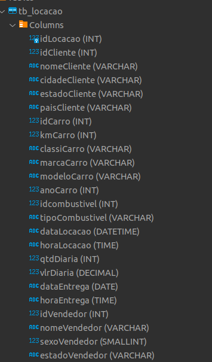
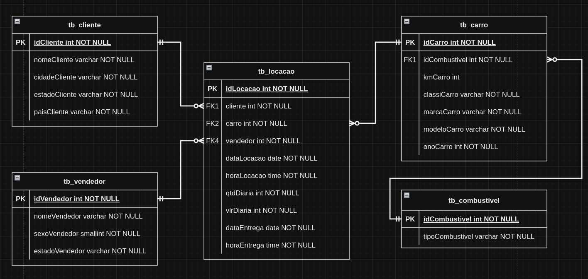
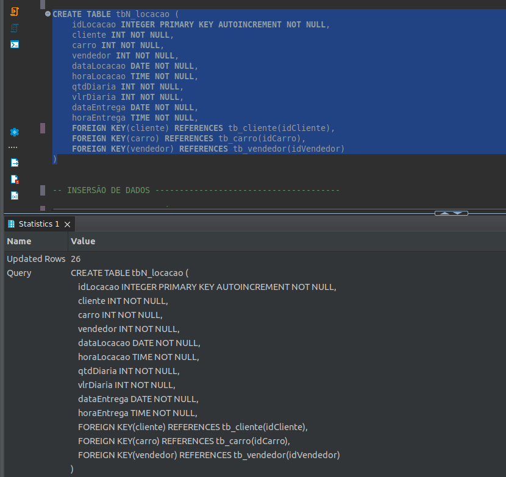
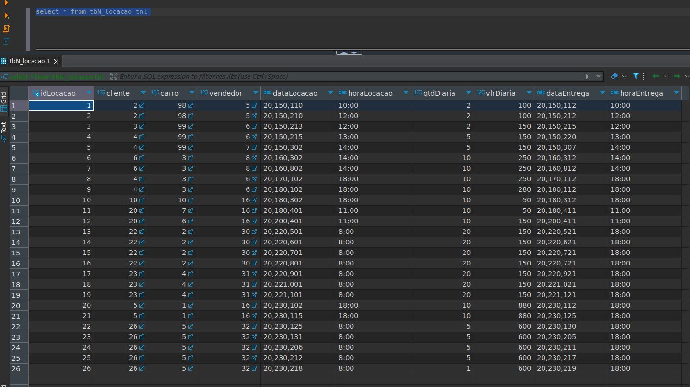
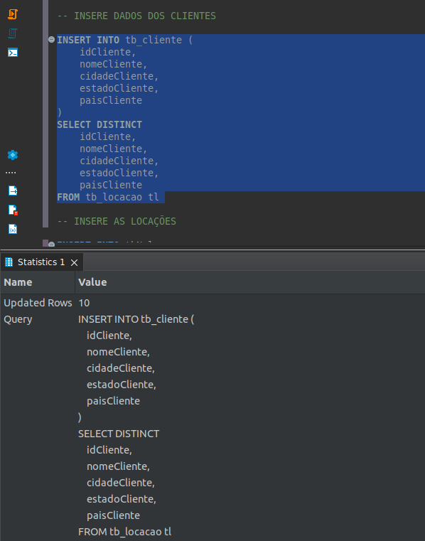
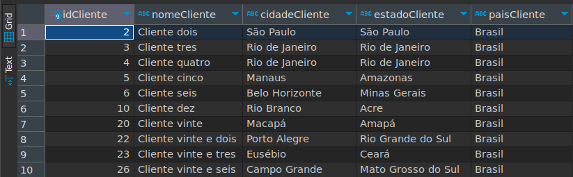
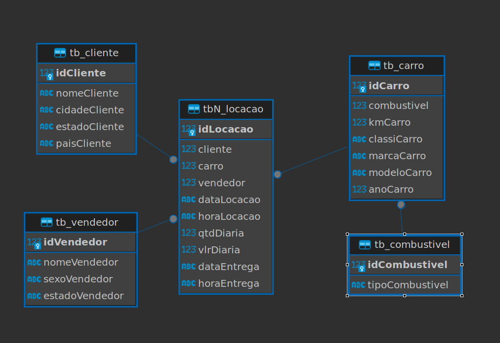
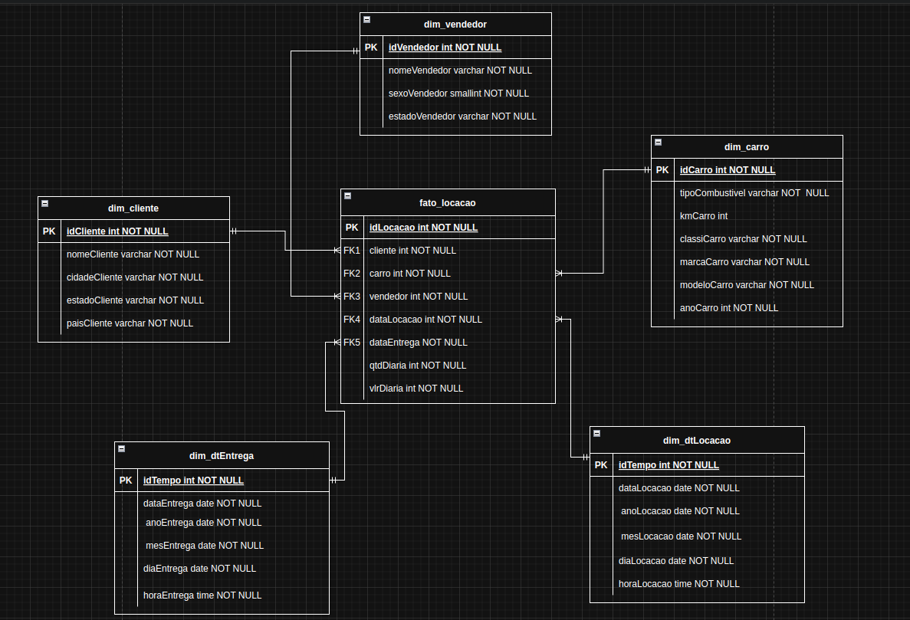
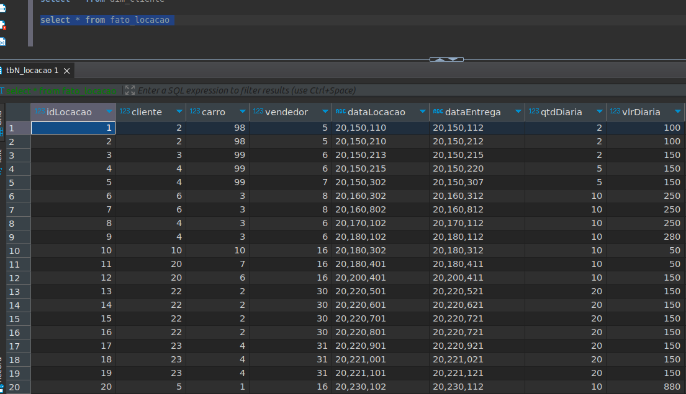

# Resumo

**Fundamentos da Segurança da Informação:** Nesse curso aprendi conceitos básicos para ter boas práticas em relação a Segurança da Informação.

**Git e GitHub:** Nesse curso aprendi sobre o versionamento no GIT, e como me conectar os repositorios na nuvem usando GitHub.

**Sql:** Aqui aprendi os principais comandos para fazer consultas em um banco de dados, usando comandos como, por exemplo, SELECT, com ele aprendi a filtrar, agrupar e ordenar resultados das queries. Com outros comandos consegui também inserir, deletar, criar e alterar tabelas.

**Modelagem Relacional e Dimensional:** Neste assunto, aprendi a organizar e **relacionar tabelas** em um banco de dados. Além disso, conheci o conceito de **normalização**. Tambêm tive conhecimento sobre a **modelagem dimensional** e alguns de seus esqumas como **Star Schema** e **Snowflake Schema**.
# Exercícios

### Exercícios SQL-1 : SQL para consultas

1. ...
[Resposta Ex1.](Exercicios/SQL-I/ex1.sql)

2. ...
[Resposta Ex2.](Exercicios/SQL-I/ex2.sql)

3. ...
[Resposta Ex3.](Exercicios/SQL-I/ex3.sql)

4. ...
[Resposta Ex4.](Exercicios/SQL-I/ex4.sql)

5. ...
[Resposta Ex5.](Exercicios/SQL-I/ex5.sql)

6. ...
[Resposta Ex6.](Exercicios/SQL-I/ex6.sql)

7. ...
[Resposta Ex7.](Exercicios/SQL-I/ex7.sql)

8. ...
[Resposta Ex8.](Exercicios/SQL-I/ex8.sql)

9. ...
[Resposta Ex9.](Exercicios/SQL-I/ex9.sql)

10. ...
[Resposta Ex10.](Exercicios/SQL-I/ex10.sql)

11. ...
[Resposta Ex11.](Exercicios/SQL-I/ex11.sql)

12. ...
[Resposta Ex12.](Exercicios/SQL-I/ex12.sql)

13. ...
[Resposta Ex13.](Exercicios/SQL-I/ex13.sql)

14. ...
[Resposta Ex14.](Exercicios/SQL-I/ex14.sql)

15. ...
[Resposta Ex15.](Exercicios/SQL-I/ex15.sql)

16. ...
[Resposta Ex16.](Exercicios/SQL-I/ex16.sql)

### Exercícios SQL-2: Extração de dados das queries em formato .csv

1. ...
[Etapa I](Exercicios/SQL-II/etapa1.csv)

2. ...
[Etapa II](Exercicios/SQL-II/etapa2.csv)

# Evidencias

Colunas da tabela locação desnormalizada:

Diagrama da modelagem relacional da concessionária:

Imagem da criação da tabela locação normalizada:

Imagem dos dados na tabela locação normalizada:

Imagem da inserção de dados na tablea Clientes:

Imagem dos dados na tabela clientes:

Imagem do diagrama gerado pelo DBeaver do modelo relacional:

Diagrama do modelagem Dimensional da concessionária:

Imagem dos dados da view da tabela fato (fato_locacao): 

# Certificados
