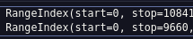
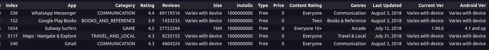
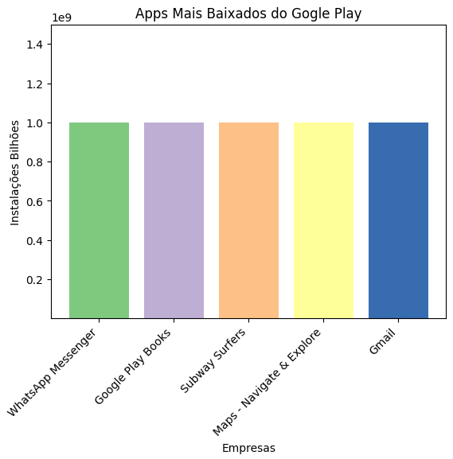
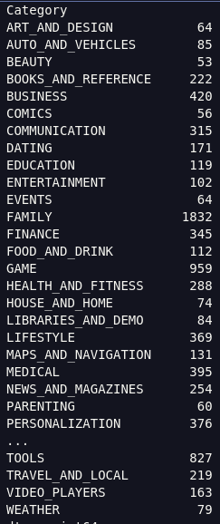
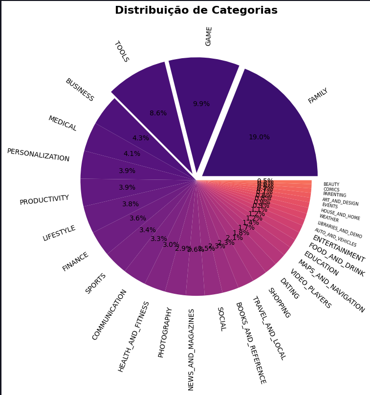
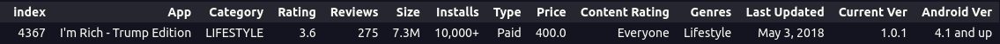
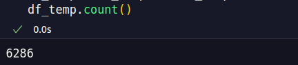
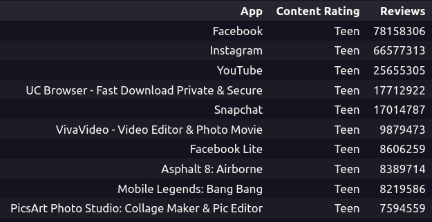
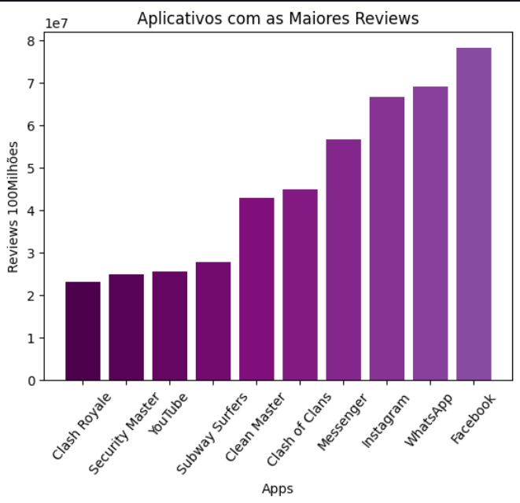
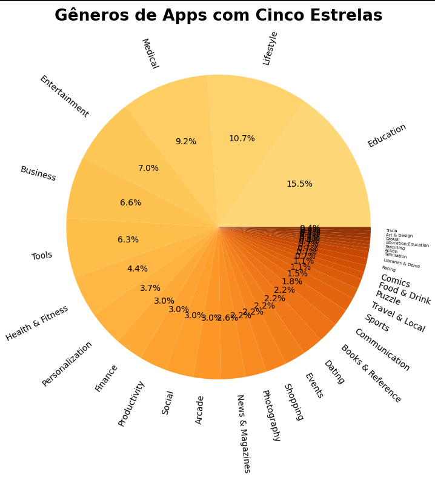

# 🎯 Desafio Sprint 2
 
Esse desafio tinha como objetivo testar os conhecimentos adquiridos no PB, sobre Python e análise de dados, o objetivo envolvia ler o arquivo e0statísticas da tabela ```googleplaystore.csv``` e coletar informações, e montar gráficos.

#### [📂 Notebook do Desafio ](./%20desafio.ipynb)  


## Recursos

#### Ambiente:
 - Anaconda 
 - Jupyter Notebook 

#### Linguagem/Bibliotecas:
 - Python (3.9.21)
 - Pandas (2.2.3)
 - MatPlotLib (3.9.4)
 - NumPy (1.26.4)


## Início
#### Primeiros 2 passos antes do início do desenvolvimento:

#### Passo 1 - Criar o Dataframe

- No código a variavel `df` é o data frame original, que é criado a partir da tabela `googleplaystore.csv`.

- Para modificações no dataframe, é utilizado a variavel `df_temp`, a partir de cada etapa ele reseta usando `df_temp = df`, mantendo sempre a tabela original durante as etapas.

Criação do dataframe:
```python
df = pd.read_csv('googleplaystore.csv')
```

#### Passo 2 - Remover Registro Inconsistente

Durante o desenvolvimento do desafio, ocoreu muitos problemas para transformações de dados devido a inconsistencias, então no início de cada etapa fazia um drop da linha inconsistente para resolver o problema, porém, acabei percebendo que todas as inconcistencias vinham de um mesmo registro:

```
Life Made WI-Fi Touchscreen Photo Frame,1.9,19.0,3.0M,"1,000+",Free,0,Everyone,,"February 11, 2018",1.0.19,4.0 and up,
```

Portanto resolvi fazer um `.drop()` do mesmo na criação do `df`, então esse registro não foi considerado.


## Desenvolvimento
---
### **1)** Remova linhas duplicatas:

Para remover linhas duplicatas, basta usar o metodo `drop_duplicates()`, nesse caso usei a coluna 'App' para remoção:

```python
df = df.drop_duplicates(subset='App', keep='first', inplace=False)
```

Indices antes e depois da remoção:



---
---

### **2)** Faça um gráfico de barras contendo os top 5 apps por número de instalação.


Para fazer esse gráfico, começei filtrado o dataframe, para pegar top 5 apps, mas as informações da coluna 'Installs' eram do tipo string, e tive que tirar os caracteres ',' e '+' para depois transformar em int:

```python
df_temp['Installs'] = df_temp['Installs'].str.replace(',' , '')
df_temp['Installs'] = df_temp['Installs'].str.replace('+' , '')
df_temp['Installs'] = df_temp['Installs'].astype(int)
```

Com a coluna 'Installs' sendo inteira poderia fazer uma ordenação decrescente e pegar os 5 valores maiores:



Agora com os maiores valores, precisava somente colocar eles no gráfico, passando as informações necessárias para duas listas, uma com o nome dos aplicativos, e outra com o número de instalações, e chamar o `plt.bar()` para montar o gráfico, adicionando cores e titulo ao gráfico também. Usei a palheta de cores 'Accent' e rotacionei os labels para melhor leitura:



---
---
### **3)** Faça um Grafico de pizza mostrando as categorias de apps existentes no dataset de acordo com a frequência em que elas aparecem.

Para separ as informções do gráfico, foi muito simples, somente usei `gruopby().size()` ele me retornou uma lista com a coluna 'Category' e a quatidade contada:



A fim de montar o gráfico , separei novamente as informações em duas listas e usei p `plt.pie()`, defini a palheta de cores 'magma', e nesse gráfico usei um explode, que destaca os maiores pedaços do gráfico, além disso reduzi as fontes das categorias menos relevantes:



---
---

### **4)** Mostre qual o app mais caro existente no dataset.

Achar o app mais caro, era achar o valor mais alto da coluna 'Price'. Então primeiro retirei os cifrões da string, depois transformei todas as informações da coluna em float, e usando o metodo `.max()` do pandas, encontrei o maior valor.

```python
df_temp['Price'] = df_temp['Price'].str.replace('$', '')
df_temp['Price'] = df_temp['Price'].astype(float)
app_mais_caro = df_temp.loc[df_temp['Price'] == df_temp['Price'].max()]
```



---
---
### **5)** Mostre quantos apps são classificados como 'Mature 17+'

Para achar esses apps fiz um filtro, onde a coluna 'Content Rating' tinha que ser igual a 'Mature 17+':

```python
df_temp = df.loc[df['Content Rating'] == 'Mature 17+']
```

Então usando `.groupby().size()` contei quantos apps tinham essa classificação.


---
---

### **6)** Mostre o top 10 apps por número de reviews bem como o respectivo número de reviews. Ordene alista de forma decrescente por número de reviews.

Para pegar os top 10 apps por reviews, basta fazer um sort pela coluna 'Reviews' e pegar os 10 primeiros itens, e para isso só tive que transformar as informações da coluna para int, e depois ordenar decrescentemente, e usar o `.head()` para selecionar os 10 primeiros itens:


---
---

#### **7)** Crie pelo menos mais 2 cálculos sobre o dataset e apresente um em formato de lista e outro em formato de valor.

---
- ##### Número de sites que tem o 'Rating' entre 4-5 estrelas:
---
Para pegar o rating entre 4 e 5, primeiro transformei as informações da coluna de strings para float, então usei `.loc[]` para filtrar somente quando 'Rating' fosse maior ou igual a 4, já que não tem classificação acima de 5, depois era so contar o número de ocorrencias, para isso usei o `.count()`:




---
- ##### Top 10 Apps para adolecentes que tem a maior quantidade de reviews:
---
Para achar esses 10 apps, comecei transformando as informações da coluna 'Reviews' em inteiros para depois ordenalos decrescentemente, após isso, apliquei um filtro para 'Teen' no 'Content Rating', e selecionei os 10 primeiros itens:



---
---

### **8)** Crie pelo menos outras 2 formas gráficas de exibição dos indicadores acima utilizando Matplotlib.
---
- ##### Apps que tem a maior quantidade de reviews:
---
Esse gráfico de barras eu construí com a lista da etapa 6, com os 10 apps que tem as maiores reviews.

Então comecei separando o nome dos apps e as reviews, em duas listas diferentes, depois mudei alguns nomes para o gráfico ficar mais limpo:
```python
lista_x[8] = 'Security Master'
lista_x[5] = 'Clean Master'
lista_x[3] = 'Messenger'
lista_x[1] = 'WhatsApp'
```

No gráfico utilizei a palheta de cores 'BuPu', como a lista estava ordenada decrescentemete, passei as listas ao contrario, a fim do grafico ficar em formato crescente, e por fim adicionei as labels:



---
- #### Gêneros dos Apps que tem 'Rating' 5.0: 
---

Para construir esse gráfico de pizza, comecei trasformando as informações da coluna 'Rating' para float, com isso o filtrei para apps com avaliação 5, e então com o `groupby()` agrupei por gêneros, então criei duas listas, uma com gênero e outra com a quantidade de apps.

Na construção do gráfico utilizei a palheta 'YlOrBr', usei novamente o `plt.pie()` e passei as listas construidas ateriormente, diminui as fontes das ultimas partes do gráfico, e criei o titulo. 



## Conclusão

Este desafio foi muito legal, com certeza uma ótima oportunidade para aplicar e aprofundar os conhecimentos adquiridos em Python, principalmente com relação à manipulação de dados usando pandas, e visualização de dados com o Matplotlib.
