# 🎯 Desafio Sprint 3

### O desafio da Sprint 3 consiste em 3 passos:

- **🧼 Limpeza de dados**: Etapa onde recebemos um CSV, oriundo de webscraping, com dados "sujos", e devemos limpar e disponibilizar esses dados para o processamento.

- **🛠️ Processamento de dados**: Agora com dados limpos, efetuamos o processamento para responder questões acerca da base de dados.

- **🐳 Docker Compose**: Criar conteiners para cada processo, e rodar ambos com o uso do `docker-compose`.

**Objetivo**: Prática com os conhecimentos de Docker e Python.

## Recursos

#### Ambiente
 - **Docker (27.4.1)**
 - **Docker-Compose (1.26.0)**

#### Linguagem/Bibliotecas:
 - **Python (3.11)**
 - **Pandas (2.0.3)**
 - **MatPlotLib (3.10.0)**
 - **Regex (2024.11.6)**
 - **NumPy (1.26.1)**
  


## Desenvolvimento

---

### Etapa 1

---

#### Análise do DataFrame:

A primeira etapa, visa limpar os dados do csv "consert_tours_by_women", aqui demonstro a análise de cada coluna, e o método para limpeza:


 ---

**Peak | All Time Peak | Ref**
 
-  **Problemas:** Há vários problemas nessas colunas, um deles é a formatação dos dados, por exemplo, "2[7]" ou "10[7]" onde as strings misturados com números, também tem muitos campos Nans (não contem informação), e além de tudo outro problema é que não se sabe exatamente oque essas colunas significam, ou qual informação delas deve-se usar, ou seja, tem ambiguidade. 
 
-  **Resolução:** Como não se tem acesso ao site do qual foi feito o web-scraping para verificar as informações, foi retirado do dataframe essas colunas inconsistentes, como o uso do `.drop()`.

---

**Actual gross | Adjusted gross | Average gross**

- **Problemas:** Todas as colunas estão em formato String, e as casas decimais separadas por ",", além de todas as informações começarem com "$".

- **Resolução:** Como a ideia é montar gráficos com as informações, é melhor que elas estejam em formato "float", por isso foi retirado os caracteres das strings usando `str.replace()` e uma expressão regex `[^\d]`, que seleciona todos os caracteres não-digito, e depois é feito a conversão de dados com `.astype(float)`.

```python
df['Actual gross'] = df['Actual gross'].str.replace(r"[^\d]", "", regex=True).astype(float)
 
```
 
---

**Year(s)**

- **Problemas:** Há duas datas em uma coluna isso dificulta a análise, além de não ser um tipo date ou um int, mas uma string.

- **Resolução:** Dividir as informações entre duas colunas no dataframe Start Year\End Year, todas as informações de data tinham 2 padrões "YYYY-YYYY" ou "YYYY", quando tem um ano somente as colunas Star e End Year deviam receber o mesmo ano, se não cada uma recebe o ano inicial e final, para resolver basta selecionar sempre os primeiros 4 caracteres e os 4 últimos, isso porque funciona para as duas formatações, então usando o `.str.[::]` que seleciona um range específico da string, selecionei os 4 primeiros dígitos e coloquei na coluna **Start Year**, e os 4 últimos na coluna **End Year**, e depois realizando a formatação para int com `.astype(int)`.

```python
df['Start Year'] = df['Year(s)'].str[0:4].astype(int)
df['End Year'] = df['Year(s)'].str[-4::1].astype(int)
```


---

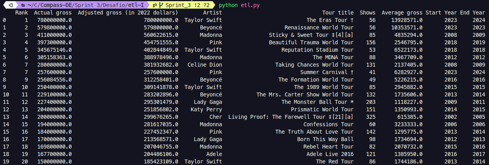

#### To csv

Após limpar o dataframe, ele é tranformado em um csv chamado **"csv_limpo.csv"**, para o consumo da próxima etapa.

#### ETL File:

[📂 etl.py](./etl-I/etl.py)

---

### Etapa 2

---

#### Questão 1

**Qual é a artista que mais aparece nessa lista e possui a maior média de seu faturamento bruto (Actual gross)?**

- Para responder à questão primeiramente, agrupamos as artistas e filtramos pelo máximo de aparições, isso vai nos dar as artistas que mais aparecem na lista, para verificação posterior elas são armazenadas na variável `artistas`, e também é armazenado em uma variável `qtd`, a quantidade de vezes que ambas apareceram, para calcular a média.

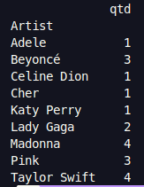

- Depois é criado um novo dataframe onde é calculado a média do "Actual gross" de cada artista.

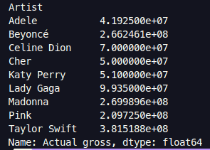

- Com a média pronta, é selecionado as artistas que estão na lista de artistas mais frequentes, e depois é selecionada a que tem a maior média. 

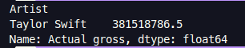

- Processo finalizado escrevendo o nome da artista no arquivo "resposta.txt".

---

#### Questão 2

**Das turnês que aconteceram em um ano, apresente a turnê com a maior média de faturamento bruto (Average gross).**

- Primeiro passo é remover as turnês que aconteceram em mais de um ano, para isso basta verifica as linhas onde Start Year e End Year são iguais.

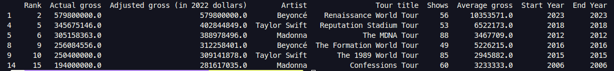

- Agora basta localizar a linha com o maior "Avarage gross".

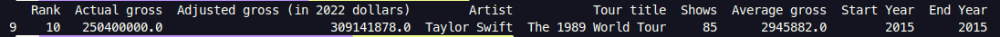

- Por último passa a turnê para o arquivo "resposta.txt"


---

#### Questão 3

**Quais são as 3 artistas que mais lucraram com menos número de shows? Cite também o nome da turnê de cada artista. Utilize a coluna "Adjusted gross (in 2022 dollars)".**

- Primeiro identifica os artistas que mais lucraram.
 
- Adiciona a quantidade de tours na "df_artist" e ordena por Adjusted gross e Tours.

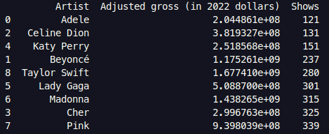

- Armazena os 3 primeiros artistas em uma lista.

- Pesquisa as tours dos artistas e armazena ambos no dicionário `tours`

- Último passo escrever os artista e suas turnês no arquivo "respostas.txt"

---

#### Questão 4

**Para a artista que mais aparece nessa lista e que tenha o maior somatório de faturamento bruto, crie um gráfico de linhas que mostra o faturamento por ano da turnê (use a coluna Start Year).**

- Primeiro passo muito parecido com a questão 1, porém não é calculado a média, basta fazer a soma do faturamento.

- Após filtrar a artista, usamos ela para identificar as turnês e seus faturamentos, selecionando esses dados em um novo dataframe.

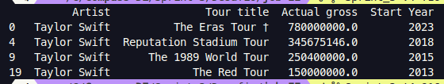

- Agora passamos as colunas "Actual gross" e "Start Year" para listas e construímos o gráfico de linhas.

- Para construir o gráfico é feito o plot, passando as listas como parâmetros, e definindo cor da linha o traçado da linha, etc. 

- Depois definimos as legendas, nomeando o gráfico e as informações para melhorar e legibilidade.

- Passamos o gráfico para um arquivo .png, para visualização posterior.

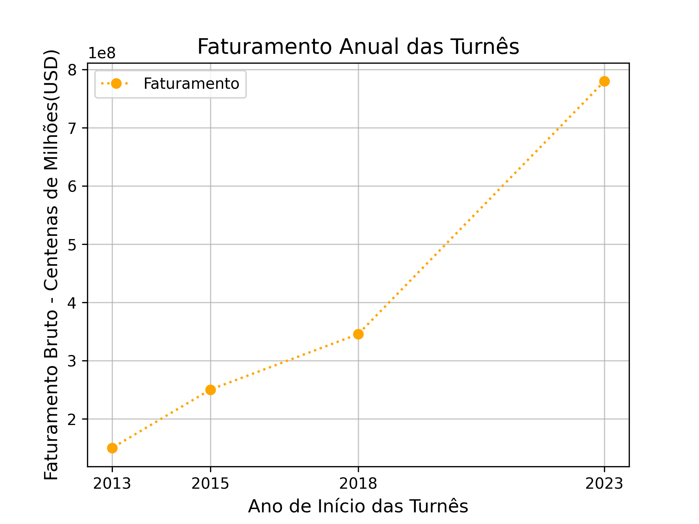

---

#### Questão 5

**Faça um gráfico de colunas demonstrando as 5 artistas com mais shows na lista.**

- Separa somente as colunas "Artist" e "Shows", Agrupa as informações por artistas, depois soma e ordena decrescentemente a coluna dos shows.

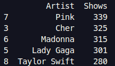

- Agora criamos duas listas, uma para shows e outra para os artistas, e passamos elas para o `plt.bar()` usando `[::-1]`, para o gráfico ficar no estilo "escada".

- Coloca o título as labes, e uma grid para facilitar a visualização.

- Muda a escala do número de shows `ylim()` para melhorar a visualização

- Adiciona os valores de shows nas barras.

- Passamos o gráfico para um arquivo .png, para visualização posterior.

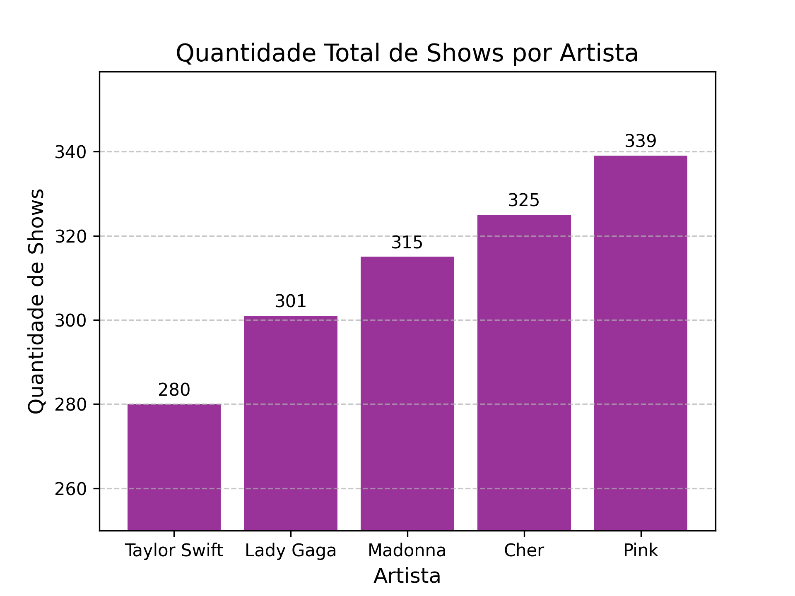
 
---
---

### Etapa 3

#### Dockerfile ETL
 
A imagem do dockerfile é a "python:3.11-slim", que já vem com o python, o código faz uso das bibliotecas pandas e regex, por isso existe um arquivo de "requirements.txt" listando as bibliotecas e as suas respectivas versões para instalação. Com as bibliotecas instaladas, é copiado para imagem o script python e base de dados csv, e em seguida o comando para começar o processamento:

[📂 Dockerfile](./etl-I/dockerfile)

**Comando para o build:**

```
docker build . -t etl
```

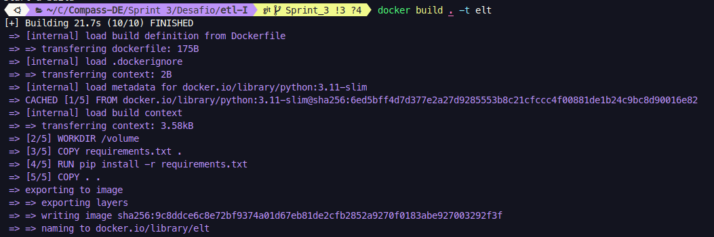

**Comando para o run:**

```
docker run  -v/home/raiel/Compass/Compass-DE/Sprint%203/Desafio/volume:/share --rm etl
```

OBS: No compose uso um volume externo onde compartilhava o arquivo "csv_limpo.csv", como não estamos no compose, fiz o mapeamento do volume pelo comando run.

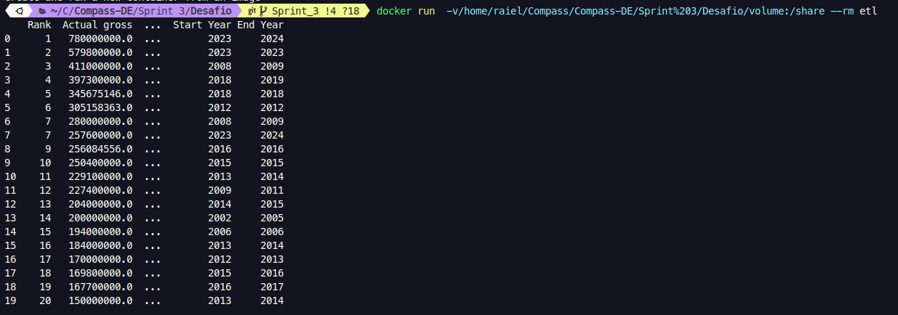

### Etapa 4 

#### Dockerfile Job

O dockerfile do job e do etl são muito parecidos, uma das únicas coisas que muda, é o WORKDIR, e o arquivo de requirements.txt, que adiciona a biblioteca matplotlib.

[📂 Dockerfile](./job-II/dockerfile)

**Comando para o build:**

```
docker build -t job .
```

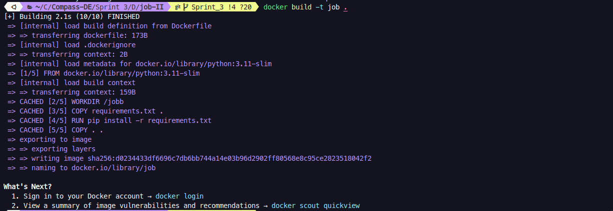


**Comando para o run:**

```
docker run job
```

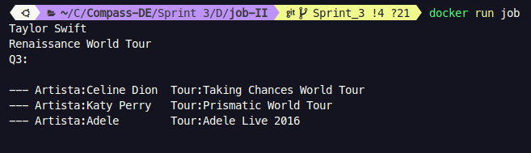

OBS: Nesse caso eu não usei o volume, passei o arquivo "csv_limpo.csv" diretamente para o docker, e como evidencia de execução, imprimi as Q1, Q2 e Q3.

---
---

### Etapa 5

#### Docker-compose

O **docker-compose** é uma ferramenta usada para a execução de múltiplos contêineres. A ideia e rodar os dois contêineres ETL e job, em um único compose.

- Criei dois "services", que vão ser os respectivos dois contêineres que vão rodar a aplicação, sendo eles, etl e job. Para garantir que o job vai rodar somente quando dados estiverem disponíveis, ele tem o `depends`, só permite a execução após o termino da execução do etl.

- Podemos criar a imagem e passar ela diretamente para o docker-compose, mas achei mais ágil, fazer o build dentro do compose, já que se fizer uma alteração não vai precisar criar a imagem e depois rodar novamente o compose, com o build no compose ele faz isso automaticamente.

- E o etl gera um arquivo "csv_limpo.csv" que o job irá consumir, e parra passar os arquivos e armazenar as respostas, fiz um volume chamado share, mapeado com a pasta volume, do repositório, onde os contêineres podem escrever e ler esses dados.

[📂 Docker Compose](docker-compose.yaml)

**Comando para o up:**

```
docker-compose up --build
```

Execução do código:

**Antes:**

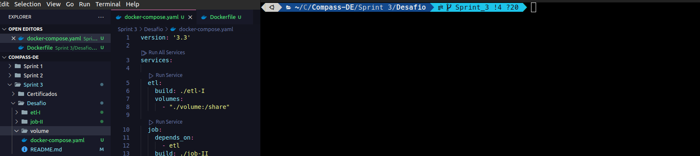

**Depois:**

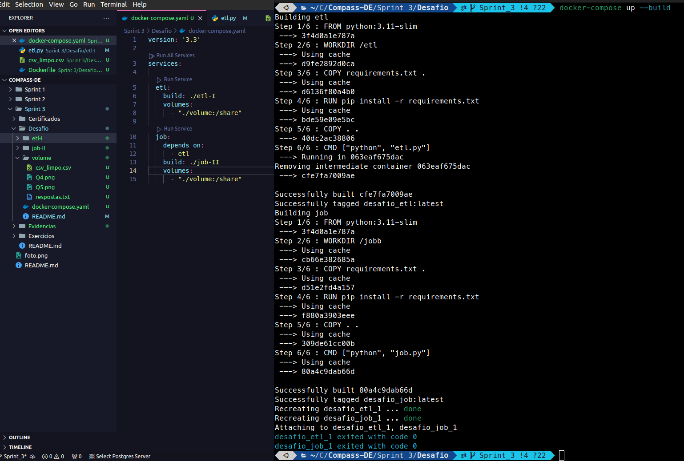

OBS: Dá pra observar os arquivos sendo criados na pasta volume.

---