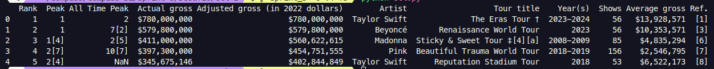

# 🎯 Desafio Sprint 3

### O desafio da Sprint 3 consiste em 3 etapas:

- **🧼 Limpeza de dados**: Etapa onde recebemos um CSV, oriundo de webscraping, com dados "sujos", e devemos limpar e disponibilizar esses dados para o processamento.

- **🛠️ Processamento de dados**: Agora com dados limpos, efetuamos o processamento para responder questões acerca da base de dados.

- **🐳 Docker Compose**: Criar conteiners para cada processo, e rodar ambos com o uso do `docker-compose`.

**Objetivo**: Prática com os conhecimentos de Docker e Python.

## Recursos

#### Ambiente

 - **Docker (27.4.1)**
 - **Docker-Compose (1.26.0)**

#### Linguagem:
 - **Python (3.11)**
 - **Pandas (2.0.3)**
 - **MatPlotLib (3.10.0)**
 - **NumPy (1.26.1)**

## Desenvolvimento

---

### ETL

A primeira etapa, tem como objetivo a limpesa de dados do csv "consert_tours_by_women", aqui mostro a análise de cada coluna, e o metodo para limpesa:

 ---

 - **Peak | All Time Gross | Ref**
 
 **Problemas:** Vamos começar pela coluna Peak, All Time Peak e Ref, há vários problemas nelas, como na formatação dos dados, por exemplo, "2[7]" ou "10[7]" onde temos strings misturados com números, muitos campos Nans (não contem informação), e outro problema é que não sabemos exatamente oque essas colunas significam, ou seja, temos ambiguidade. 
 
 **Resolução:** Como não podemos consultar o site do qual foi feito o web-scraping só retiramos do data-frame essas colunas inconsistentes.

---

 - **Actual gross | Adjusted gross | Average gross**

**Problemas:** Todas as colunas estão em formato String, e as casas decimais separadas por ",", além de todas as informações começarem com "$".

**Resolução:** Como vamos montar gráficos com as informações, é melhor que elas estejam em formato "int".