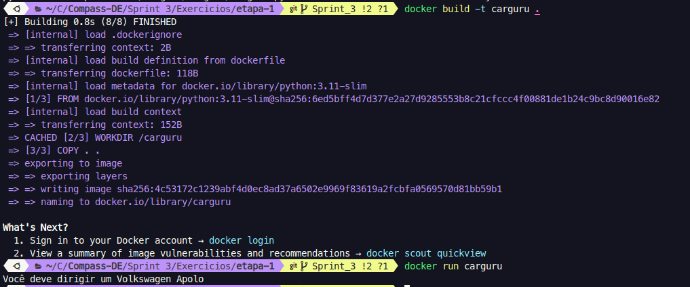
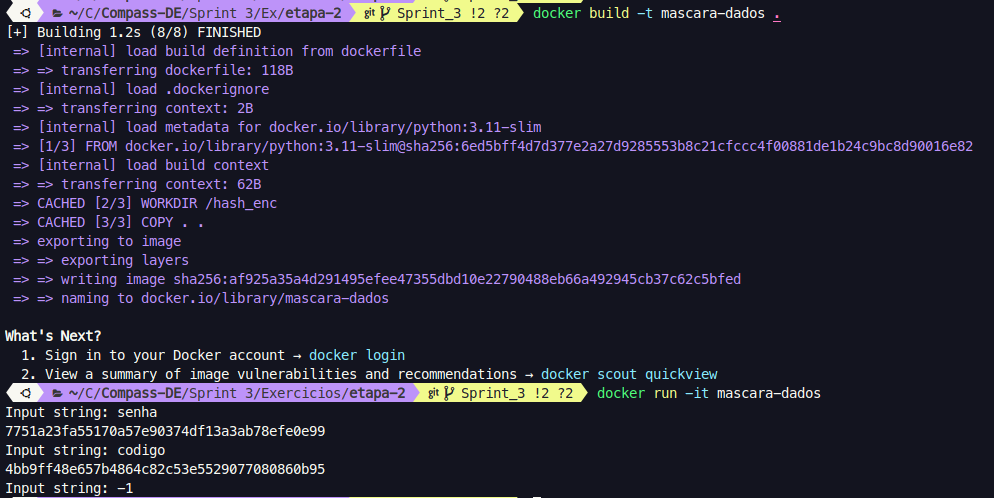
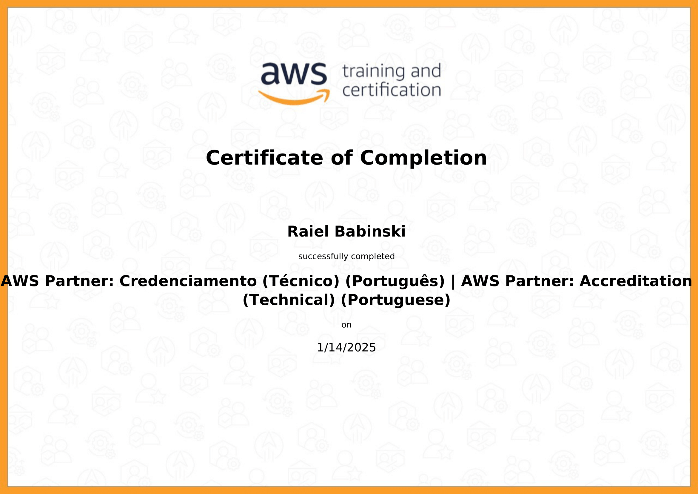

#  🏆 **Sprint 3**  🏆

## 📚 **Conteúdos**

### ☁️ **AWS Partner: Accreditation**  

Aprendi sobre as ferramentas básicas da AWS, como planejar um projeto de migração para a nuvem, como executar esse projeto da melhor forma, e boas praticas para construção de sistemas eficientes.

---

### 🐳 **Docker**  

**Nesse curso explorei a ferramenta docker, e aprendi sobre:**

- Criação de containers
- Criação de imagens para geração de containers
- Criação de volumes e networks
- Docker compose 
- Docker Swarm
- Kubernetes

---

## 📝 **Exercícios**

### **Exercício I - Carguru**  
 
   [📂 Carguru](./Exercicios/etapa-1/carguru.py)  

   [📂 Dockerfile](./Exercicios/etapa-1/dockerfile)  

     

---

### **Exercício II - Mascaração de dados**  

   [📂 Hash_encode](./Exercicios/etapa-2/hash_enc.py)  
 
   [📂 Dockerfile](./Exercicios/etapa-2/dockerfile)  

      

---

### 🎯 [ Desafio ](./Desafio/README.md)

--- 

## 🎓 **Certificados**  

