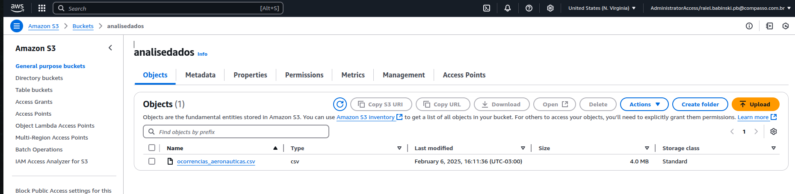
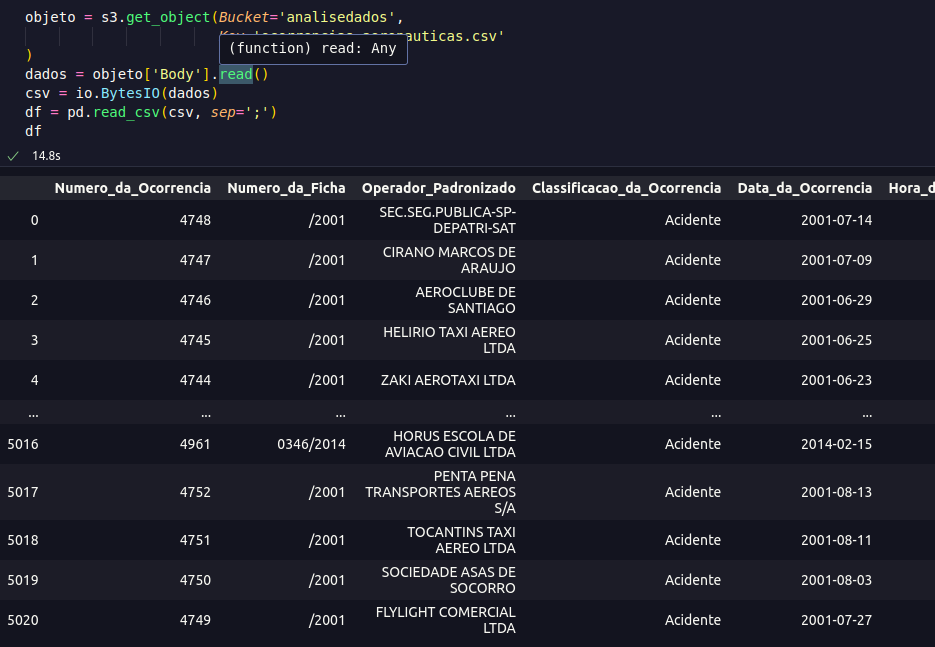
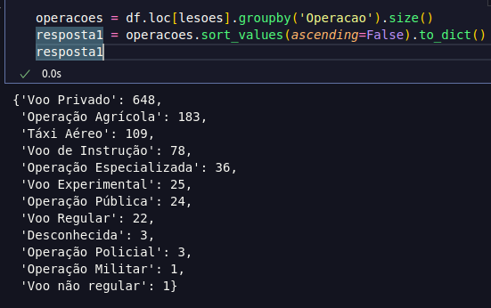
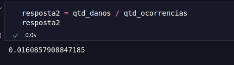

# 🎯 Desafio Sprint 4

O desafio consiste em duas etapas, primeiro a escolha de um conjunto de dados csv no Portal Brasileiro de Dados Abertos, a análise desse conjunto e definição de 3 perguntas sobre esse conjunto, além disso, também fazer o upload desse arquivo para um bucket no s3.

Com os dados no bucket a segunda etapa e consumir esses dados diretamente do s3 para executar as análises, e retornar uma resposta sobre as análises.

## Recursos

#### Nuvem
- **Amazon Simple Storage Service (s3)**

#### Linguagem/Bibliotecas:
 
 - **Python (3.11)**
 - **Pandas (2.0.3)**
 - **Boto3 (1.28.54)**
 - **BytesIO (Built In)**
  

## Desenvolvimento

---

### Etapa 1

---

#### Arquivo CSV

O arquivo escolhido contém dados das ocorrências Aeronáuticas envidas pela Força Aérea Brasileira. Escolhi esse arquivo, pois apesar de não ser bem estruturado em todos os campos, ele é bem extenso e permite algumas análises interessantes.

[🌐 Link do Arquivo CSV](https://dados.gov.br/dados/conjuntos-dados/ocorrencias-aeronauticas)

---

#### Perguntas

---

**Pergunta 1: Qual é o número total de ocorrências por tipo de operação onde houve ao menos uma lesão fatal?**

- Uma cláusula que filtra dados usando ao menos dois operadores lógicos.
- Função de agregação.

---

**Pergunta 2: Qual é a proporção de ocorrências com danos 'Destruída', que aconteceram na fase de pouso, para aeronaves com mais de 4 assentos?**

- Função condicional.
- Função de agregação.

---

**Pergunta 3: Qual é proporção de ocorrências que aconteceram no ano de 2023, onde a descrição do tipo de ocorrência contém a palavra 'colisão'?**

- Função de conversão (Datas)
- Função de data
- Função de String

---

#### Carregando Dados Para o Bucket

---

Para fazer o upload para o s3, utilizei o AWS CLI e no arquivo credentials copiei as chaves de acesso para uso seguro do boto3.

Para construir o arquivo python que faz o upload para o s3, que basicamente é iniciar uma sessão com o boto3, escolher o serviço que vai ser utilizado, e depois passar o nome do bucket, o caminho do arquivo e o caminho do bucket para o upload.

```python
s3.upload_file(arquivo, bucket, caminho_s3)
```



### Etapa 2

#### Ler Arquivo do bucket

Para o início da etapa 2 preciso ler o arquivo diretamente do bucket, iniciei uma seção com o boto3, da mesma forma de antes.

Então recebi um objeto, fiz a leitura desse objeto, porém, o pandas não aceitava o formato bytes, etão usei o BytesIO, para simular um arquivo csv e o pandas conseguir ler o csv.



### Análises:
---
#### Pergunta 1: Qual é o número total de ocorrências por tipo de operação onde houve ao menos uma lesão fatal ou grave?

- Passo 1: Criar um filtro para todas as ocorrências que tem ao menos 1 lesão fatal ou grave, crio um dataframe que contem true ou false nas colunas e depois passo no método loc, para facilitar a visualização.

- Passo 2: Usar o filtro criado anteriormente, fazer um agrupamento por operação, calcular quantidade de operações e depois ordenar decrescentemente.



---

#### Pergunta 2: Qual é a proporção de ocorrências com danos 'Destruída', que aconteceram na fase de pouso, para aeronaves com mais de 4 assentos?

- Passo 1: Criar um filtro para ter ocorrências onde a aeronave foi destruída e tem mais que quatro assentos, além das que aconteceram na fase de pouso (foi feita separadamente para a proporção). Para o filtro de ocorrências foi condicional, e para aeronaves 'Destruídas' foi usado o `isin()` que retorna um booleano para valores que estão ou não na coluna.

- Passo 2: Criar um dataframe com os dados filtrados.

- Passo 3: Armazenar a quantidade ocorrências durante a fase de pouso com 4 assentos e a quantidade de ocorrências onde esse avião nessa fase foi destruído.

- Passo 4: Calcular a proporção.


 
---

#### Pergunta 3: Qual é proporção de ocorrências que aconteceram no ano de 2023, onde a descrição do tipo de ocorrência contém a palavra 'colisão'?

Passo 1: Transformar a coluna "Data_da_Ocorrência" em datetime.

Passo 2: Filtrar o dataframe para ter colunas somente de 2023.

Passo 3: Usa o método contains, para verificar se a palavra 'colisão' está na coluna 'Descrição_do_Tipo', usa regex para identificar o padrão (considera "colisao" também). 

Passo 4: Armazena a quantidade de ocorrências de 2023, e a quantidade de ocorrências filtradas.

Passo 5: Calcula a proporção.


---

#### Resposta

Depois de filtrar e achar os resultados escrevo tudo em um arquivo resposta:

[📂 Respostas](./etapa-II/respostas.txt)