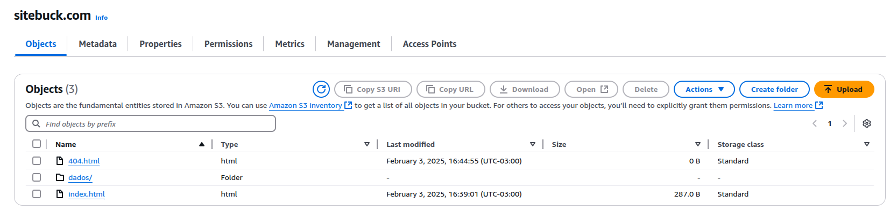
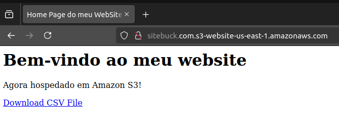
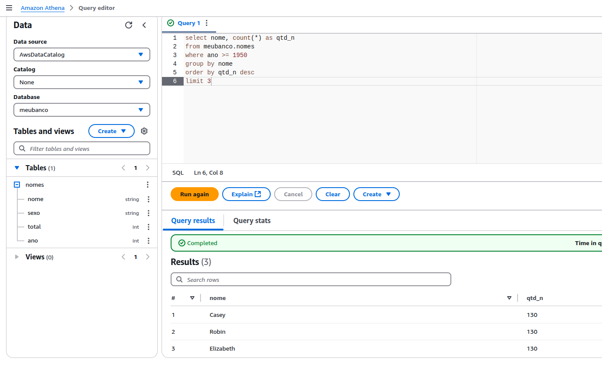
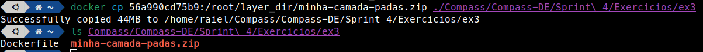
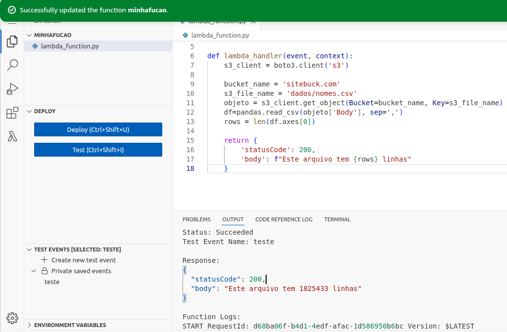
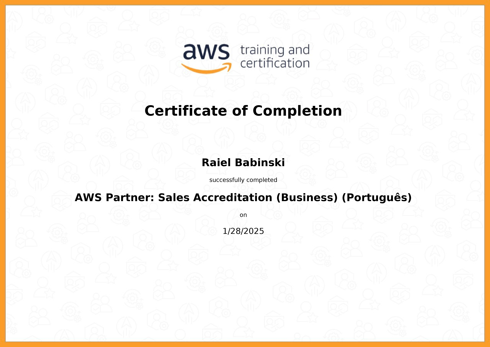
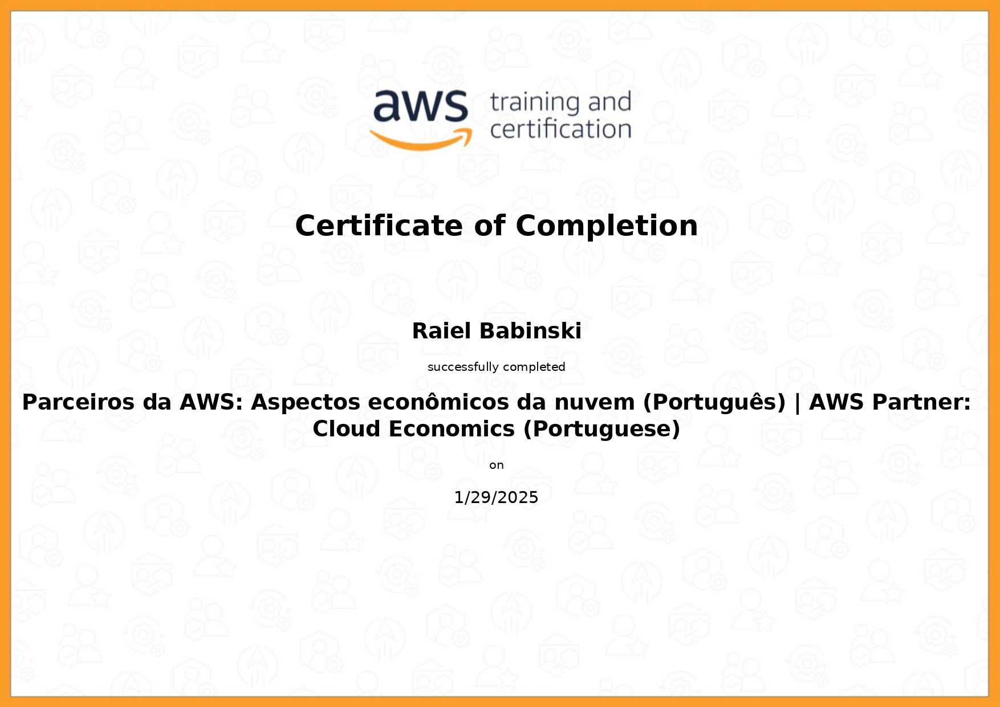
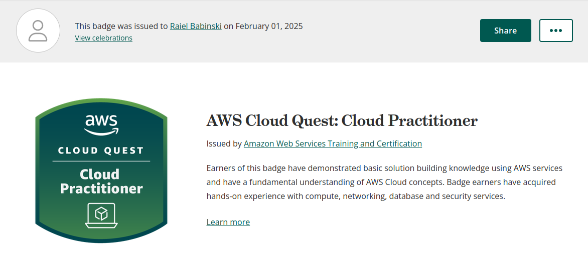

#  🏆 **Sprint 3**  🏆

## 📚 **Conteúdos**

### **AWS Partner : Sales Accreditation**  

No curso, aprendi sobre os desafios de clientes para adotar a nuvem, e como mostrar os benefícios da AWS, e lidar com objeções comuns a nuvem, e também ferramentas e incentivos disponíveis para parceiros.

---

### **AWS Partner : Cloud Economics**  

O AWS Cloud Economics me ensinou como otimizar custos, de diferentes formas. Aprendi sobre os pilares principais: redução de custos, produtividade da equipe, resiliência operacional e agilidade nos negócios. No final, entendi que a nuvem pode gerar uma boa economia para qualquer situação.

---

### **AWS Cloud Quest: Cloud Pratictioner**

Nesse curso/jogo aprendi de forma aplicada, resolvendo impedimentos que imitam os problemas reais, sobre as principais ferramentas da AWS, e como usa-las para cada situação.

## 📝 **Exercícios**

### **Exercício I - s3 Site Estático**  

[📂 Ex1](./Exercicios/ex1/)

Objetos dentro do bucket:

Site estático:

---

### **Exercício II - Athena**  

[📂 ex2](./Exercicios/ex2)

Resultado da query na base de dados criada no Amazon Athena:

---

### **Exercício III - Lambda**

[📂 ex3](./Exercicios/ex3)

Cópia da camada do volume docker para a máquina local:

Execução da função lambda na AWS

---
---

### 🎯 [ Desafio ](./Desafio/README.md)

---
--- 

## 🎓 **Certificados**  

---

---
