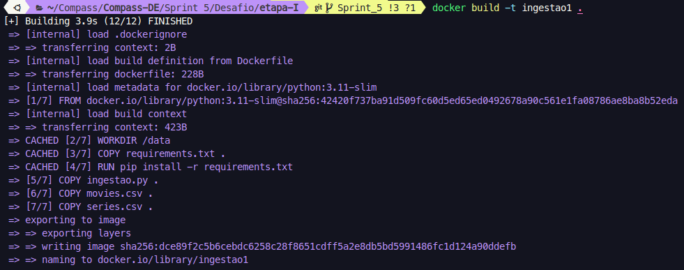
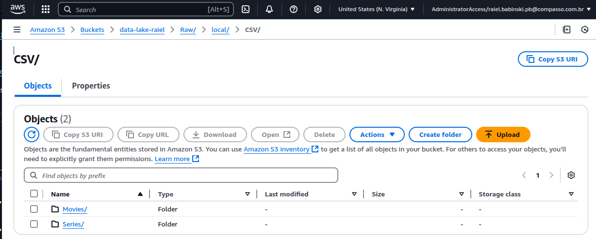
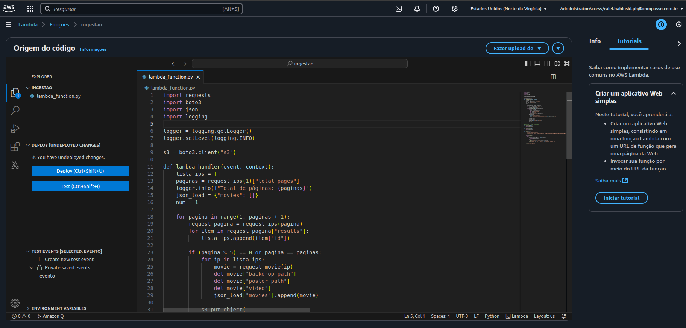
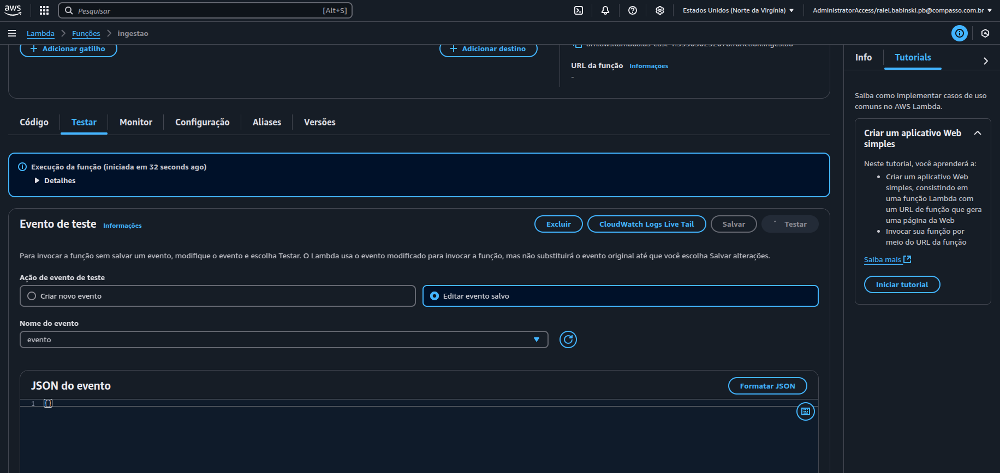
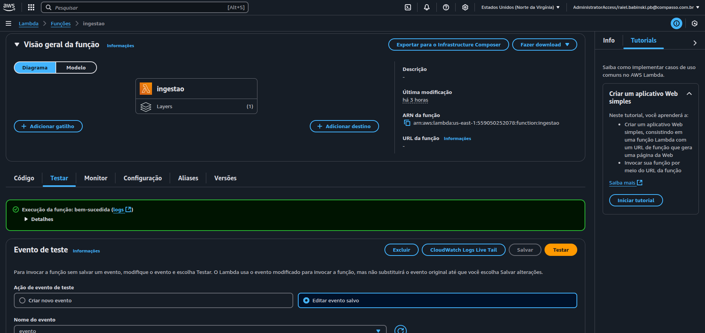
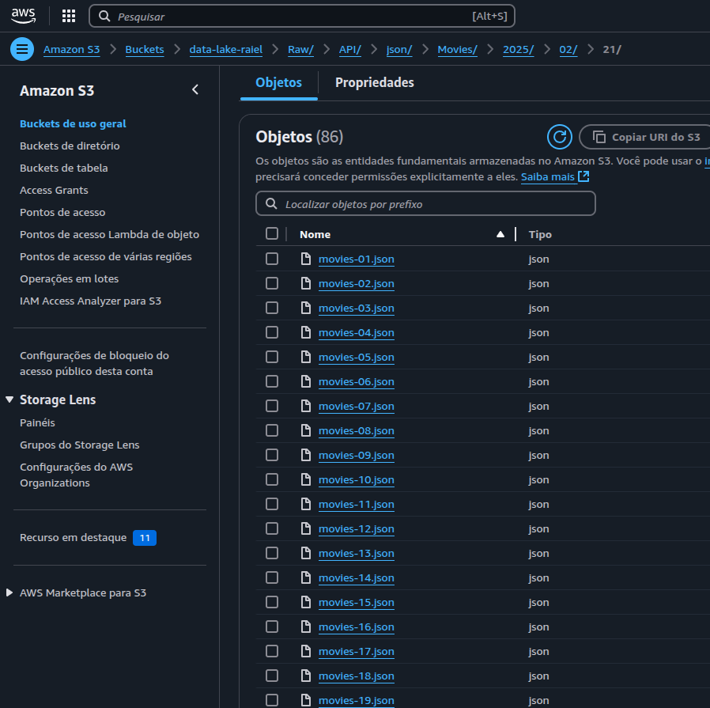

# 🎯 Desafio Sprint 5

O desafio da Sprint 5, são as duas primeiras etapas do Desafio final, que consiste em fazer o upload de dois arquivos csvs, e usar o AWS lambda fazer a ingestão de dados da API do TMDB, para complementar os dados do csv inicial.

## Primeiros Passos:

Os dados complementares que serão ingeridos do TMDB, irão levar como base algumas perguntas que gostaria de responder na etapa final, meu squad teve como tema Terror/Mistério, então desenvolvi meu questionamento baseado neles.

## Pergunta

Como se deu a evolução da popularidade dos filmes de terror até a década de 90?

O objetivo da minha análise vai ser tentar investigar como os filmes de terror se tornaram populares antes da década de 90, pesquisando na internet 1980-1990 é considerado por muitos o período com os melhores e mais relevantes filmes de terror, então meu objetivo é tentar entender como esses filmes se desenvolveram ao longo do tempo, como se tornaram populares e ganhar o seu espaço no mercado.

### Questionamentos

- Como o número de filmes de terror lançados evoluiu ao longo das décadas?

- Houve um aumento nas sequências e franquias de terror ao longo do tempo?

- Qual a relação entre orçamento e popularidade dos filmes de terror?

- Quais foram os anos com maior número de lançamentos de filmes de terror?

- Houve um aumento no Budget dos filmes de terror ao longo das décadas?

- Como foi a evolução da receita dos filmes de terror ao longo das décadas?

- O tempo de duração dos filmes de terror aumentou ao longo do tempo?


## Etapa - I

### 1 - Ingestão 

Essa etapa consistia em enviar os dados para o S3 por meio de um docker, então para isso, criei um script python usando a biblioteca boto3, esse script vai dentro da máquina docker responsável por fazer o upload.

[📂 Ingestão](./etapa-I/ingestao.py)

O script é simples, ele cria o cliente "s3", e envia os dois arquivos csvs para suas respectivas pastas dentro do S3, as credenciais da AWS são acessadas por meio de um arquivo com variáveis de ambiente.

---

### 2 - Docker

Docker será a maquina que vai rodar o script python, segue o Dockerfile para a construção da imagem:

[📂 Dockerfile](./etapa-I/Dockerfile)

A imagem base, é um linux que vem com python, dentro do contêiner faço a instalação do botoe por meio do requirements, passo os arquivos csvs, o script e executo o programa lá dentro.

Build da imagem:



---

Execução do contêiner:


OBS: Para não escrever as chaves de acesso da AWS no diretamente no volume ou no código, passei elas em um arquivo .env na execução do contêiner.

---

Arquivos no bucket:



## Etapa - II

A Etapa II consistia em extrair dados da API do TMDB para complementar o csv.

Para conseguir filtrar somente os filmes de 1990, usei uma requisição chamada discover da API do TMDB, porém essa requisição tinha pouca informação, não iria complementar o csv.

Então para pegar mais detalhes dos filmes, usei os ids retornados na requisição do discover, e fiz uma requisição para cada filme, assim obtendo todas as informações.

### Código

---

O código tem três etapas:

- Etapa 1: Tendo em vista que a requisição discover na API do TMDB retorna 20 filmes por página, e cada json tem que ter 100 registros, o script faz 5 requisições na API, juntando 100 ips em uma lista, ele repete esse processo até o final das páginas.

```python
for pagina in range(1, paginas + 1):
    request_pagina = request_ips(pagina)
        
    for item in request_pagina["results"]:
        lista_ips.append(item["id"])
```

- Etapa 2: Com a lista de 100 ips, o script faz 100 requisições, para obter as informações completas dos filmes, armazenando elas em um dict, sequencialmente. O script também remove informações, que não fazem parte da análise.

```python
if (pagina % 5) == 0 or pagina == paginas:
    for ip in lista_ips:
        movie = request_movie(ip)
        del movie["backdrop_path"]
        del movie["poster_path"]
        del movie["video"]
        json_load["movies"].append(movie)
```

- Etapa 3: Transforma o dict em json e envia para s3.

```python
s3.put_object(
    Bucket="data-lake-raiel",
    Key=f"Raw/TMDB/JSON/Movies/2025/02/21/movies-{str(num).zfill(2)}.json",
    Body=json.dumps(json_load, indent=4)
)
```

Esse processo se repete até que todas as páginas sejam enviadas para o bucket no s3.

[📂 Ingestão JSON](./etapa-II/ingestao.py)

### Lambda

---

Terminado o código na máquina local, passei para uma função lambda. Não teve muitas mudanças no código, somente adicionei o logger para visualizar os loggs no CloudWatch, e a camada da AWS "PandasLayer" para usar a biblioteca requests.

Função lambda na AWS:



Função executando:



Função executada:



Arquivos no s3:

