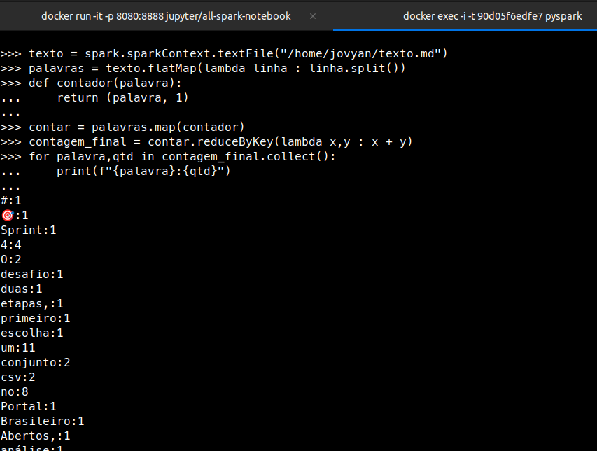
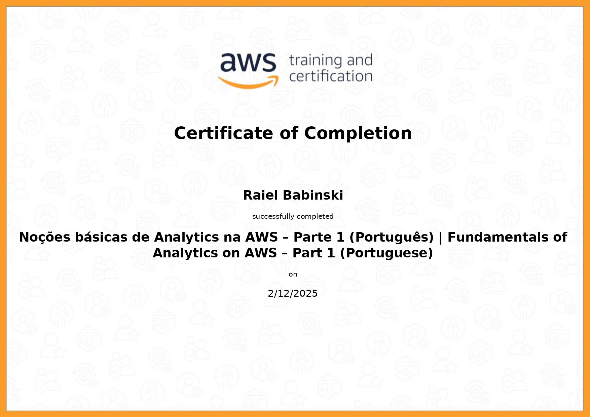
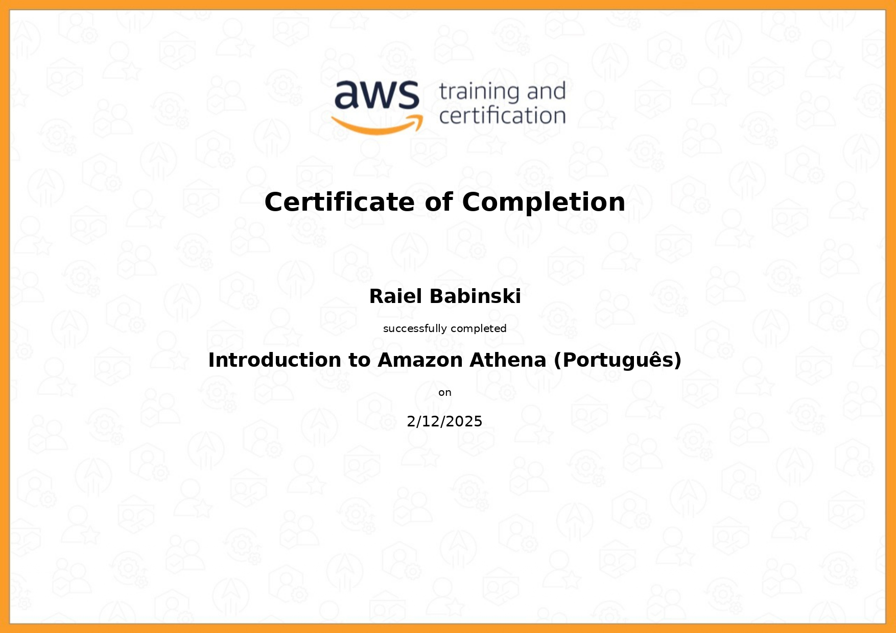
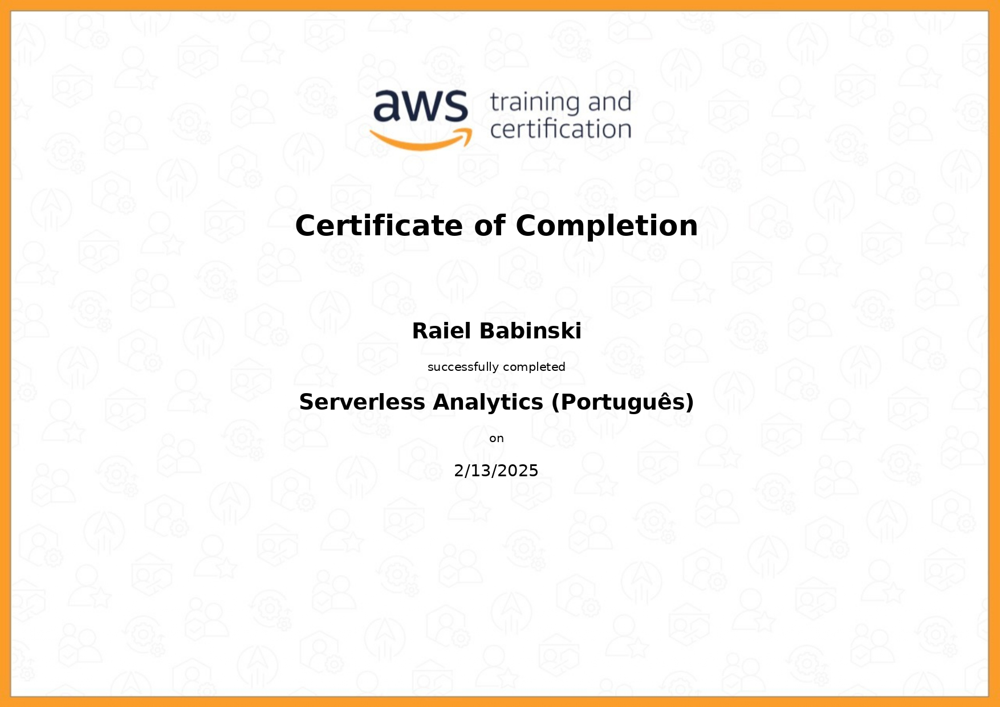

#  🏆 **Sprint 5**  🏆

## 📚 **Conteúdos**

### **AWS Partner : Fundamentals_of_Analytics**  

Esse curso é uma introdução aos conceitos básicos de análise de dados na AWS. Ele aborda tópicos como big data, aprendizado de máquina, e os principais serviços da AWS usados para análise de dados.

---

### **AWS Partner : Introduction_Amazon_Athena**  

O curso "AWS Partner: Introduction to Amazon Athena" ensina como usar o Amazon Athena, um serviço de consultas SQL sem servidor para dados no Amazon S3.

---

### **AWS Partner: Serverless Analytics**

O curso ensina a criar soluções de análise de dados na AWS sem a necessidade de gerenciar servidores. Nele, aprendi a utilizar ferramentas como AWS Lambda, Amazon S3 e Redshift para desenvolver soluções escaláveis de forma prática.

---

### **Apache Spark - Pyspark**

O curso ensina a usar a feramenta Spark com o python, para processamento de dados massivos usando computação distribuida. Ele mostra como configurar e utilizar o Spark e como otimizar o desempenho e escalabilidade dos processos.

## 📝 **Exercícios**

---

### **Exercício I - pySpark**  

[📂 ex1](./Exercicios/ex1/comandos_spark.txt)

---

### **Exercício II - TMDB API**

[📂 ex2](./Exercicios/ex2/ex2.py)

---
---

### 🎯 [ Desafio ](./Desafio/README.md)

---
--- 

## 🎓 **Certificados**  

---

---
