# 🎯 Desafio Sprint 6

O desafio consistia em Passar os dados csv e json, ingeridos no Desafio Sprint 5, para a camada Trusted no s3.

Para passar esses dados para a Trusted, precisamos que eles estejam padronizados, para assim conseguir acessar os dados com AWS Athena a partir do AWS Glue Catalog.

Esses processos envolvem:

- Converter tipos de dados ✅

- Verificar nomes das colunas ✅

- Remover duplicatas ✅

# Desenvolvimento

## Dados CSV

### Movies

Primeira parte do desenvolvimento eu fiz utilizando o spark em uma máquina local, para depois passar o processo para o glue.

- **Lendo o arquivo movies.csv**

Nesse caso utilizo o próprio read.csv do spark, já que ele consegue ler arquivos do s3 dentro do glue.

```python
spark.read.csv("movies.csv", header=True, sep="|")
```

---

- **Iniciando a Padronização analisando os tipos de dados**

Importante para esse passo analisar as colunas para definir os tipos:

Amostra de dados do movies.csv:

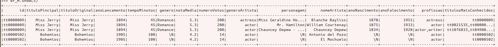

Por mais que se use o `inferSchema` do spark por conta de inconsistências todas as colunas ficam como String Type.

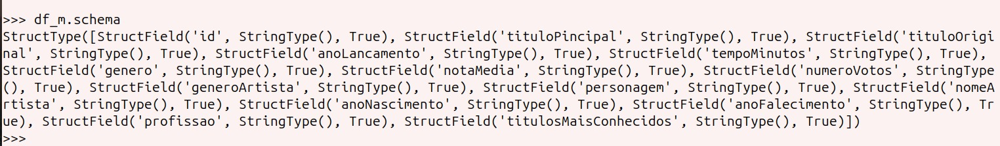

O dataframe tem várias colunas para transformação de inteiro ou double, sendo elas:

 - anoLancamento
 - tempoMinutos
 - notaMedia (Double)
 - numeroVotos
 - anoNascimento
 - anoFalecimento

OBS: Nas transformações do spark, as colunas que tem a strings "\N" se tornam null.

---

- **Trasformações para Int/Double**

Para fazer as transformações utilizei o `withColumn()` com o `cast()`.

Exemplo:

```python
df_movies.withColumn("anoLancamento", col("anoLancamento").cast("int"))
```

Tipos Corrigidos:

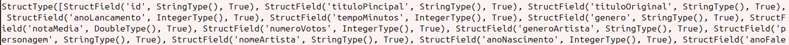

---

- **Correção Nome das Colunas**

É importante definir bons nomes para as colunas, porem o csv ja tem um header, que define bem as colunas, só temos uma coluna com erro de português "tituloPincipal", então foi feita a correção do nome.

```python
df_movies.withColumnRenamed("tituloPincipal", "tituloPrincipal")
```

---

- **Remover Linhas Duplicatas/Nulas**

Aqui aplicamos um processo para remover linhas que são iguais, em todas as colunas, e também linhas onde todas as colunas são nulas.

```python
df_movies.dropDuplicates()
df_movies.dropna(how='all')
```

Agora temos o dataframe pronto, depois quando o código for para o glue, temos que gravar ele em formato parquet no s3.

---

### Series

Apesar de ter algumas colunas diferentes do dataframe movies, o processo é parecido.

- **Lendo series.csv**

```python
spark.read.csv("series.csv", header=True, sep="|")
```

- **Iniciando a Padronização analisando os tipos de dados**

Dados de series.csv:

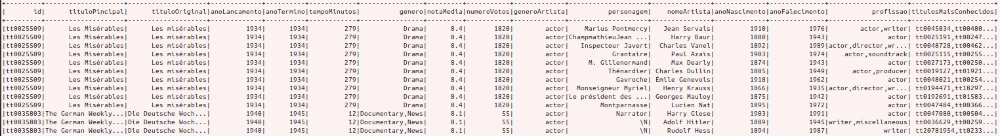

Analisando o dataframe temos que mudar para int/double as seguintes colunas:

- anoLancamento
- anoTermino
- tempoMinutos
- notaMedia (Double)
- numeroVotos 
- anoNascimento
- anoFalecimento

- **Transformações para Int/Double**

No CSV de series decidi fazer um schema para usar no dataframe, esse é usado já na leitura do csv.

```py
schema = StructType([
    StructField("id", StringType(), True),
    StructField("tituloPincipal", StringType(), True),
    StructField("tituloOriginal", StringType(), True),
    StructField("anoLancamento", IntegerType(), True),
    StructField("anoTermino", IntegerType(), True),
    StructField("tempoMinutos", IntegerType(), True),
    StructField("genero", StringType(), True),
    StructField("notaMedia", FloatType(), True),
    StructField("numeroVotos", IntegerType(), True),
    StructField("generoArtista", StringType(), True),
    StructField("personagem", StringType(), True),
    StructField("nomeArtista", StringType(), True),
    StructField("anoNascimento", IntegerType(), True),
    StructField("anoFalecimento", IntegerType(), True),
    StructField("profissao", StringType(), True),
    StructField("titulosMaisConhecidos", StringType(), True)
])
```

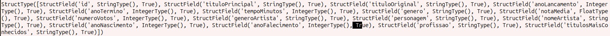

- **Coreção do Nome da Coluna**

Series tem uma coluna com o nome errado, então fiz a correção.

```py
df_series.withColumnRenamed("tituloPincipal", "tituloPrincipal")
```

- **Remover Linhas Duplicatas/Nulas**

Aplicamos o mesmo processo de movies, para remover linhas duplicatas ou nulas do dataframe.

```python
df_series.dropDuplicates()
df_series.dropna(how='all')
```

Agora Juntamos os dois códigos para montar o job no Glue.

### Construindo o Job no Glue

Os códigos feitos anteriormente, foram testados em máquina local, agora vamos adaptar para o glue.

- **Criando Job CSV**

Comecei o processo iniciando a configuração do job na AWS:

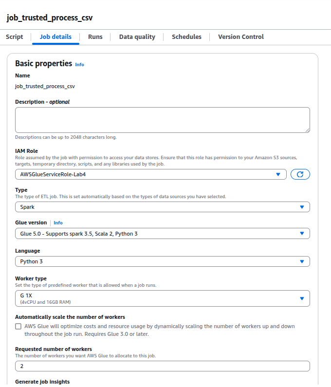

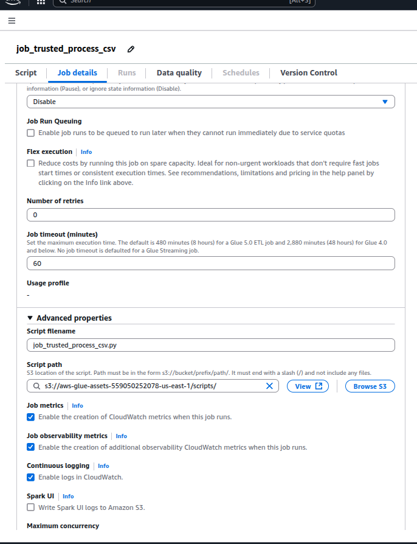

- **Variáveis de Input e Target S3**

O "spark.read" do csv tanto de movies quanto de series, tem que acontecer diretamente do s3, então criei variáveis de ambiente para armazenar os caminhos:

- S3_INPUT_PATH_MOVIES
- S3_INPUT_PATH_SERIES
- S3_TARGET_PATH_MOVIES
- S3_TARGET_PATH_SERIES

---

- **Escrita do Parquet no s3**

Inicialmente tive a ideia de transformar o dataframe em dynamic frame para escrever os dados no s3 e armazenar o schema diretamente do job, porém tive muitos problemas para fazer a conversão. Então para evitar gastos, utilizei o próprio spark para escrever no s3, e para armazenar o schema utilizei o crawler do glue.

Posteriormente, pesquisando na internet, descobri que a tem como rodar um contêiner na máquina local que simula o glue da AWS, acho que será uma boa alternativa para verificar se o código funciona antes de rodar ele diretamente na nuvem.

Modificações para o glue:

- Escrita no s3

```py
df_movies.write \
    .mode("overwrite") \
    .format("parquet") \
    .save(target_movies)
```

```py
df_series.write \
    .mode("overwrite") \
    .format("parquet") \
    .save(target_series)
```

- Removendo df da memória

Como fiz o processo dos dois csvs em um único job, quando termino o processo de movies, libero a memória para não ocupar espaço do próximo processo.

```py
del df_movies
```

Script Job:

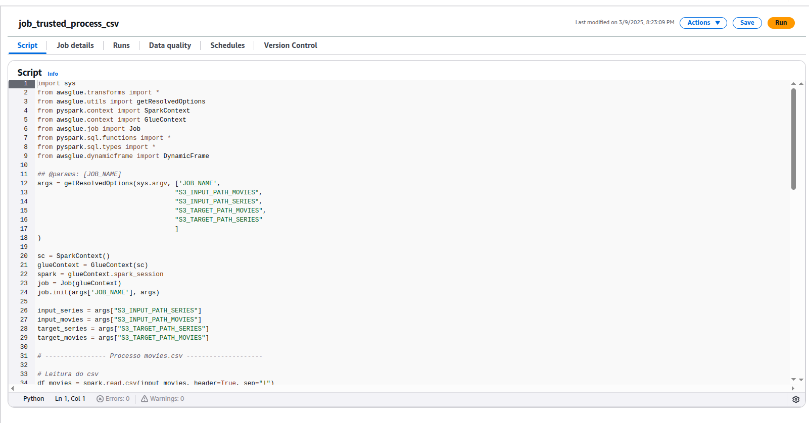

Dados s3:

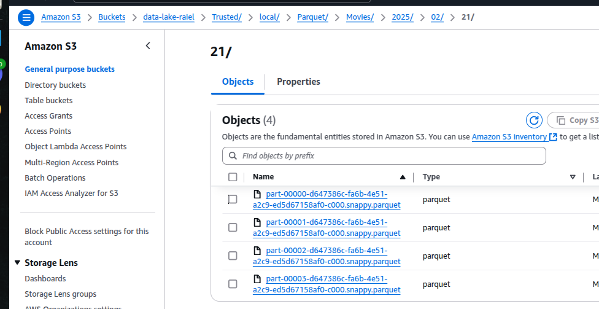

---

- [📂 Job csv](./Job_csv.py)

### Crawler csv

Para extrair os schemas criei o database "cinema_db", e fiz a construção dos crawlers.

Construir crawler na AWS é fácil, basta colocar a fonte dos dados o database, e nome da tabela que vai ser criada.

- Crawler Movies

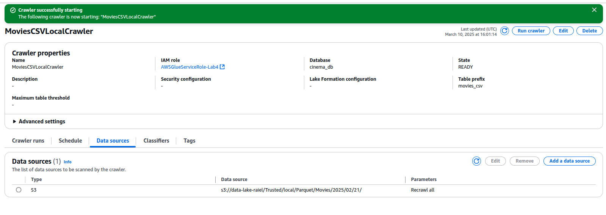

- Tabela "movies_csv"

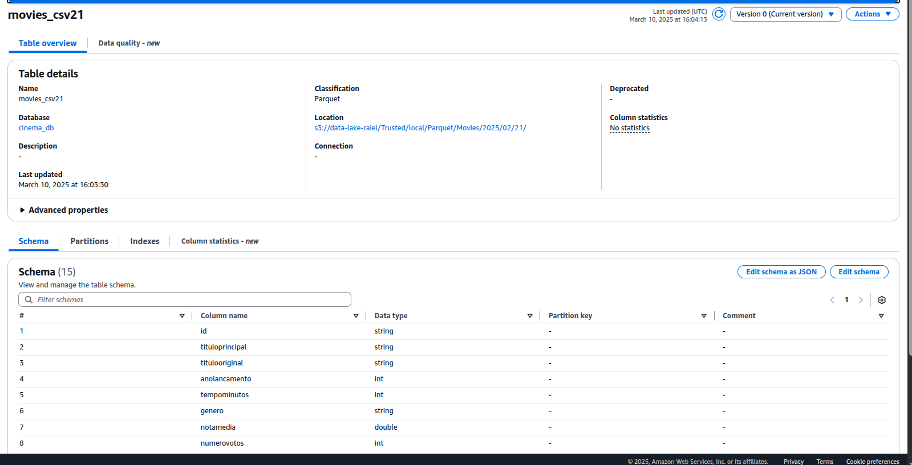

- Crawler Series

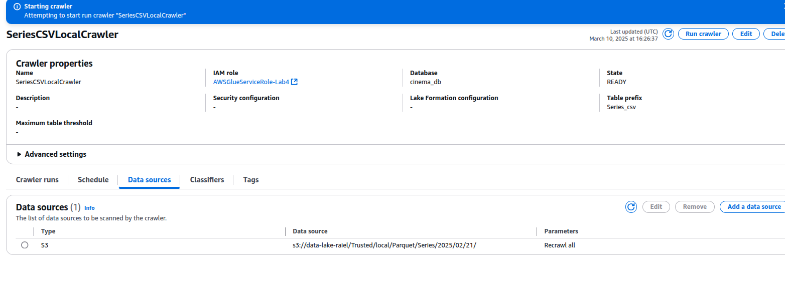

- Tabela "series_csv"

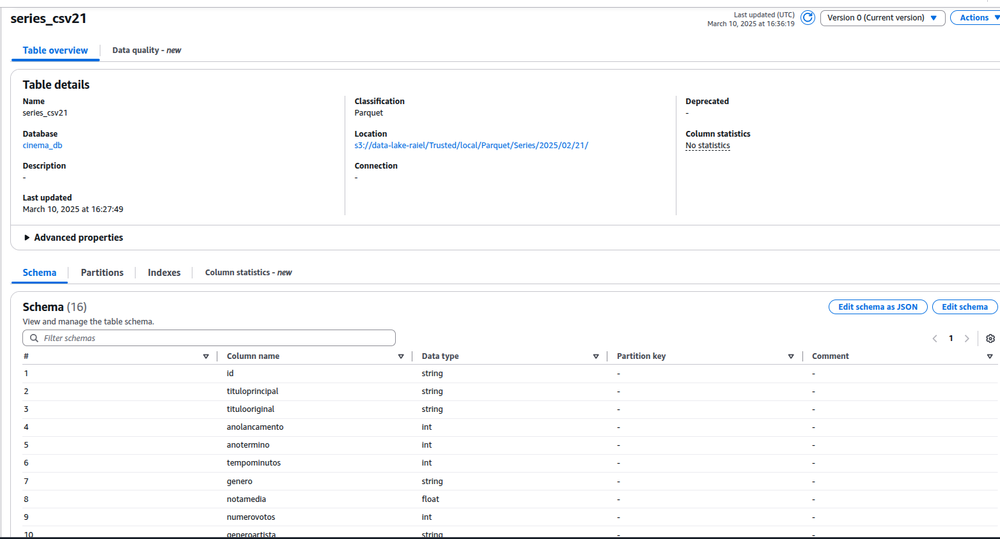

## JSON

Com certeza o arquivo json foi mais complicado de se lidar, pois as informações não eram completas, e a estrutura do json do TMDB era complexa.

- **Leitura do Json**

- Esse é um item do json.

```json
{
    "movies": [
        {
            "adult": false,
            "belongs_to_collection": null,
            "budget": 0,
            "genres": [
                {
                    "id": 12,
                    "name": "Adventure"
                },
                {
                    "id": 14,
                    "name": "Fantasy"
                },
                {
                    "id": 27,
                    "name": "Horror"
                }
            ],
            "homepage": "",
            "id": 38120,
            "imdb_id": "tt0051226",
            "origin_country": [
                "US"
            ],
            "original_language": "en",
            "original_title": "Zombies of Mora Tau",
            "overview": "A fortune hunter leads a search for diamonds guarded by undead sailors off the coast of Africa.",
            "popularity": 1.003,
            "production_companies": [
                {
                    "id": 3458,
                    "logo_path": null,
                    "name": "Clover Productions",
                    "origin_country": "US"
                }
            ],
            "production_countries": [
                {
                    "iso_3166_1": "US",
                    "name": "United States of America"
                }
            ],
            "release_date": "1957-03-01",
            "revenue": 0,
            "runtime": 69,
            "spoken_languages": [
                {
                    "english_name": "English",
                    "iso_639_1": "en",
                    "name": "English"
                }
            ],
            "status": "Released",
            "tagline": "Zombies of the African Voodoo coast!",
            "title": "Zombies of Mora Tau",
            "vote_average": 5.5,
            "vote_count": 28
        }, ...
```


- Estava tendo problemas para ler o json, descobri que para o spark precisa de uma configuração para permitir linhas dentro das linhas, então no método read passei como opção o multiline, e resolveu o problema.

```py
df_json = spark.read.option("multiline", "true").json("s3...")
```

- O resultado:

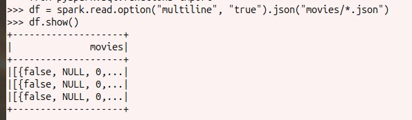


- Oque aconteceu, as informações do json são uma lista dentro da chave movies, para os testes utilizei 3 arquivos json, cada linha é um arquivo com 100 registros, então basta usar o explode(), para que cada item do array se transforme em uma linha do dataframe:

```py
df_json = df_json.select(explode(df_json.movies))
```

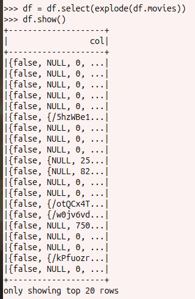

- Ainda não temos as colunas, mas cada linha agora é um filme, porém queremos todos os registros, o spark oferece uma forma de acessar esse tipo de informações.

Por exemplo, se quisermos acessar a informação "title" do filme na primeira linha, podemos escrever "col.title", e acessaremos. Ou seja, se selecionarmos todas as informações, e transformarmos elas em um dataframe "col.*" (poderia utilizar o select(), porém teria que escrever o nome de todas as colunas), teremos o resultado:

```py
df_json = df_json.selectExpr("count.*")
```

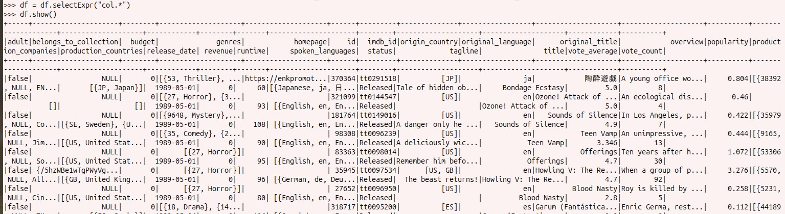

- **Padronização dos tipos de dados**

Primeiramente resolvi checar a tipagem que o spark inferiu nos dados:

```py
    StructField('adult', BooleanType(), True),

    StructField('belongs_to_collection', StructType([
        StructField('backdrop_path', StringType(), True),
        StructField('id', LongType(), True),
        StructField('name', StringType(), True),
        StructField('poster_path', StringType(), True)
    ]), True),

    StructField('budget', LongType(), True),

    StructField('genres', ArrayType(
        StructType([
            StructField('id', LongType(), True),
            StructField('name', StringType(), True)
        ])
    ), True),

    StructField('homepage', StringType(), True),
    StructField('id', LongType(), True),
    StructField('imdb_id', StringType(), True),

    StructField('origin_country', ArrayType(StringType(), True), True),
    StructField('original_language', StringType(), True),
    StructField('original_title', StringType(), True),
    StructField('overview', StringType(), True),
    StructField('popularity', DoubleType(), True),

    StructField('production_companies', ArrayType(
        StructType([
            StructField('id', LongType(), True),
            StructField('logo_path', StringType(), True),
            StructField('name', StringType(), True),
            StructField('origin_country', StringType(), True)
        ])
    ), True),

    StructField('production_countries', ArrayType(
        StructType([
            StructField('iso_3166_1', StringType(), True),
            StructField('name', StringType(), True)
        ])
    ), True),

    StructField('release_date', StringType(), True),
    StructField('revenue', LongType(), True),
    StructField('runtime', LongType(), True),

    StructField('spoken_languages', ArrayType(
        StructType([
            StructField('english_name', StringType(), True),
            StructField('iso_639_1', StringType(), True),
            StructField('name', StringType(), True)
        ])
    ), True),

    StructField('status', StringType(), True),
    StructField('tagline', StringType(), True),
    StructField('title', StringType(), True),
    StructField('vote_average', DoubleType(), True),
    StructField('vote_count', LongType(), True)

```

Esse schema foi tirado diretamente do json, e ele esta tipado de forma correta.

- **Correção de nomes**

Não achei nenhum nome que necessitasse de alguma correção.

- **Remover Linhas Duplicatas/Nulas**

```py
df_json.dropDuplicates().dropna(how="all")
```

- **Explode em colunas**

Bom o dataframe tem várias colunas que são do tipo Array, não achei uma boa ideia, por conta da quantidade de linhas a mais que iria produzir, e tem algumas informações que não preciso, gostaria de remover antes de fazer o explode, como não é a etapa de remoção, apenas disponibilizar o conteúdo para queryes no Athena, resolvi deixar as colunas como Array na Trusted.

### Construção do job

- Configuração do job AWS:

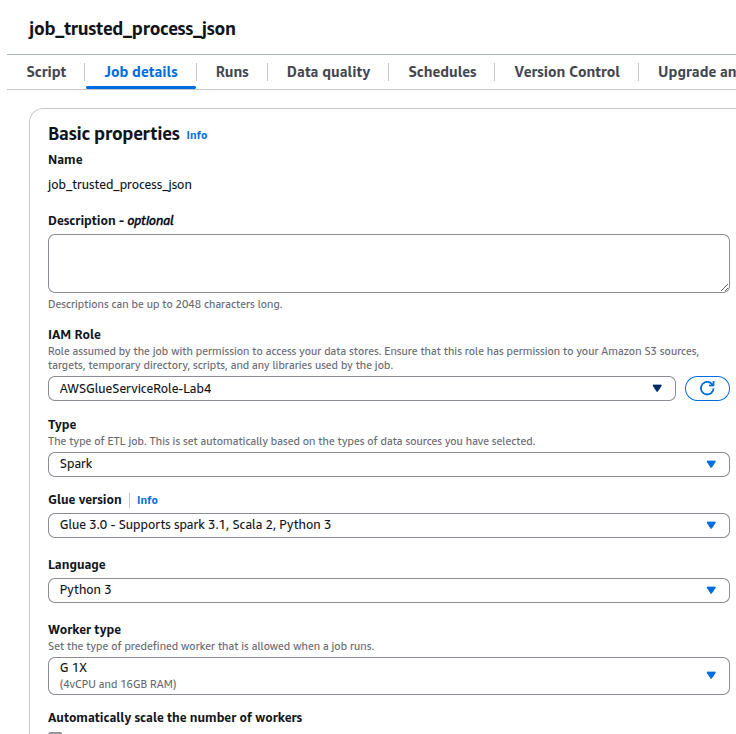

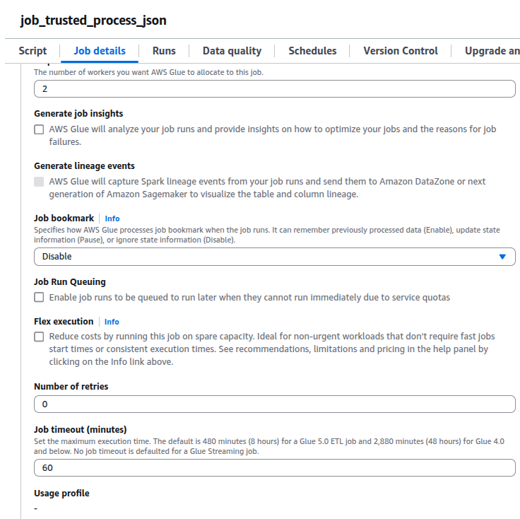

- **Variaveis de Input e Target S3**

Para o job json também criei variáveis de ambiente para passar o input e target path.

- S3_INPUT_PATH
- S3_INPUT_PATH

- **Escrita do Parquet no s3**

Para o dataframe do tmdb também escrevi com o spark no s3, e o catalogo com crawler.

```py
df_json.write \
    .mode("overwrite") \
    .format("parquet") \
    .save(target_movies)
```

Script no Job:

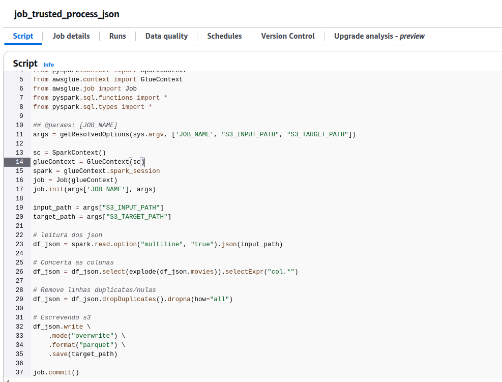

Arquivos no s3:

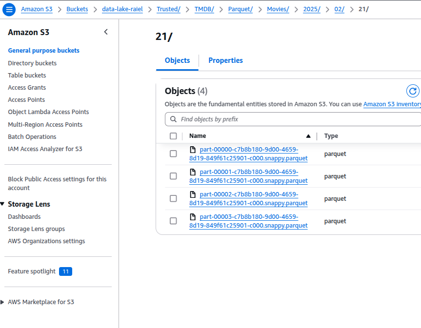

----

- [📂 Job json](./Job_json.py)

### Crawler Json

Imagens da construção do crawler para os dados json.

- Crawler json

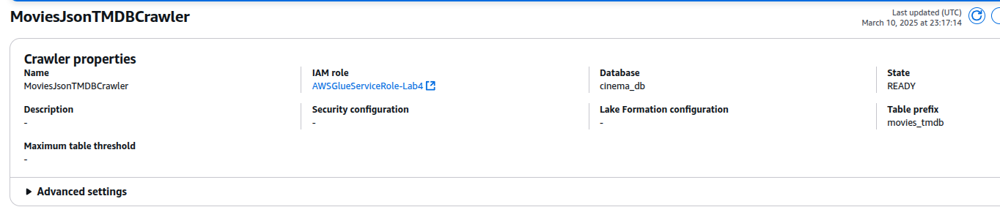

- Tabela "movies_tmdb"

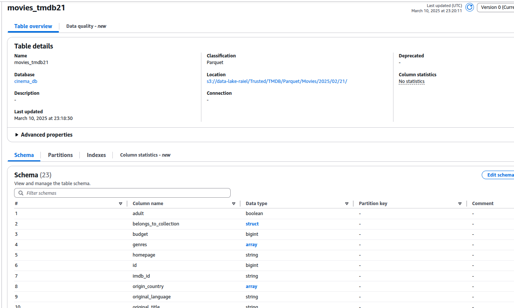