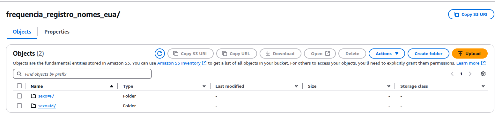
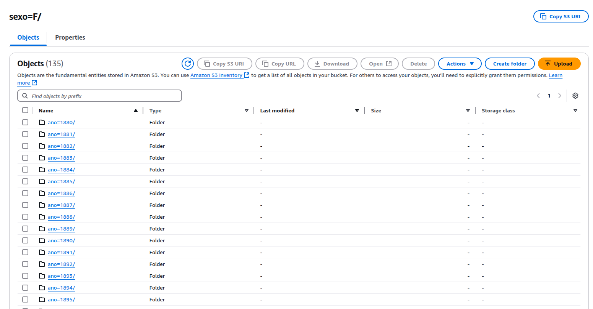
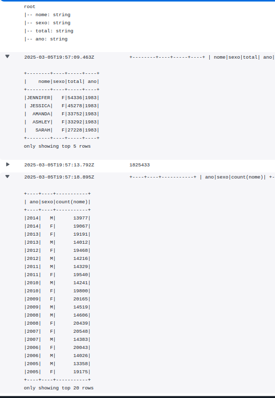
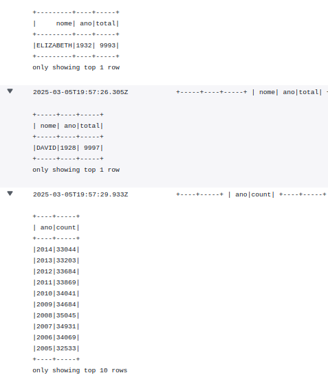
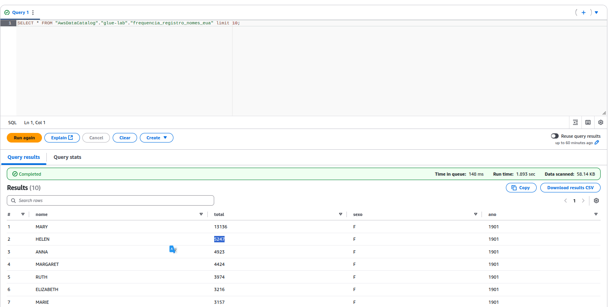
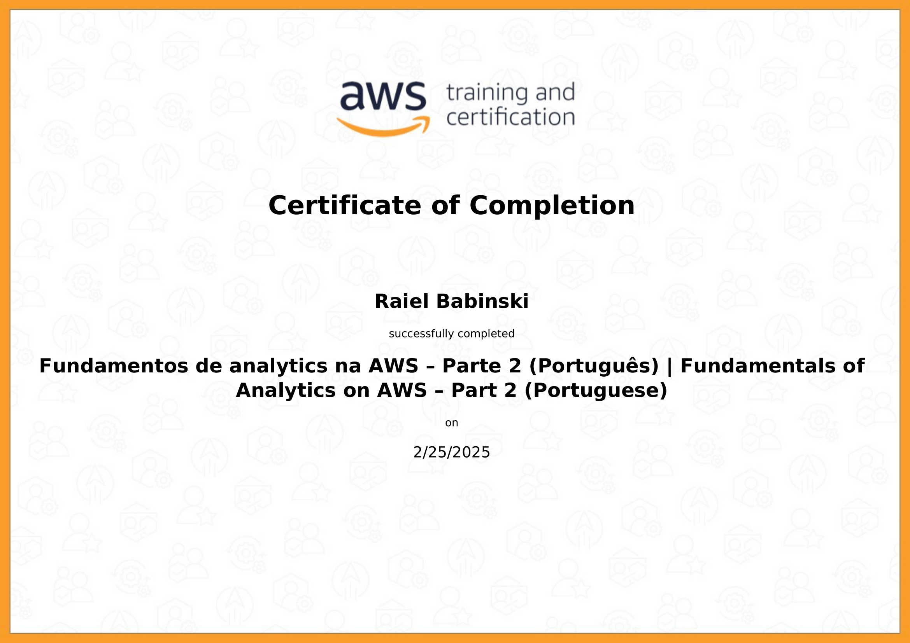
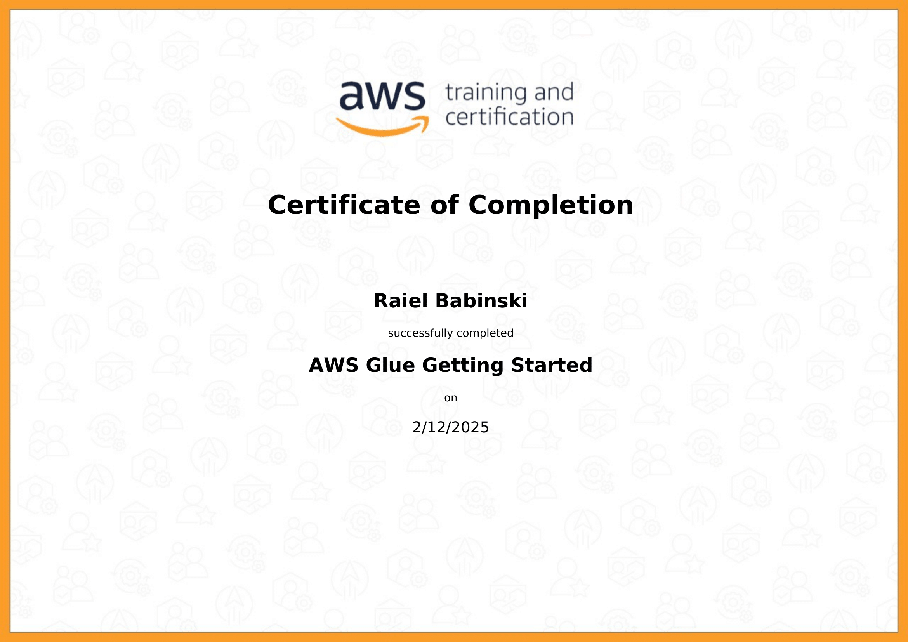

#  🏆 **Sprint 6**  🏆

## 📚 **Conteúdos**

### Fundamentals of Analytics on AWS – Part 2 

No curso aprendi sobre arquiteturas modernas de análise de dados na AWS, incluindo data lakes, data warehouses e estratégias de ETL/ELT. O curso mostrou os principais serviços de analise como AWS Glue, Amazon Redshift e Amazon Athena para processamento e consulta de grandes volumes de dados. O curso aborda tópicos de otimização dos processos para menor custo das operações

---

### AWS Partner : AWS Glue Getting Started

Este curso ensina o básico do serviço AWS glue, aprendi a configurar um catálogo de dados, usar crawlers para detectar esquemas automaticamente e criar jobs de ETL para transformar e mover dados. Também explorei como executar scripts em PySpark e consultar dados com Amazon Athena.

---

### Tutoriais Técnicos Analytics

A playlist traz vídeos introdutórios em português, sobre análise de dados na AWS. Ensina a usar as principais ferramentes de Analytics, no caso o Glue, Athena e o QuickSight.

## 📝 Exercícios

### Exercício I - Geração de dados  

[📂 etapa I](./Exercicios/ex1/etapa1.py)

[📂 etapa II](./Exercicios/ex1/etapa2.py)

- [📂 animais](./Exercicios/ex1/txts/animais.txt)

[📂 etapa III](./Exercicios/ex1/etapa3.py)

- [📂 nomes aleatórios](./Exercicios/ex1/txts/nomes_aleatorios.txt)

### **Exercício II - Apache Spark**

[📂 ex2](./Exercicios/ex2/ex2.py)

### Lab AWS Glue

- **Arquivos no s3**

- **Logs do Job no Glue**

- **Tabelas Geradas Automaticamente pelo Crawler**

- **Script Do Job no Glue**

[📂 Script Job](./Exercicios/glue_lab/script/lab_job.py)

---

### 🎯 [ Desafio ](./Desafio/README.md)

---

## 🎓 **Certificados**  

---

---

