# 🎯 Desafio Sprint 7

O desafio dessa sprint tinha como objetivo a transformação de dados da trusted para refined. Esse processo consiste, em criar uma modelagem de dados dimensional, que favoreça as consultas para criação da visualização, pelo Quick Sight.


## Desenvolvimento

Passos para o desenvolvimento:

- Construir a tabela base

- Criar um modelo dimensional

- Criar o job para construção das tabelas fato/dimensão

- Executar o job no AWS Glue

- Validar e testar os dados com AWS Athena

### Construção da Tabela Base

Para definir um modelo, é necessário saber quais dados levar para o modelo dimensional, e analisando os dados disponíveis, tirei algumas conclusões:

- Não será usado series.csv:

Motivo é claro, series não fazem parte do estudo.

- Não será usado movies.csv:

Movies é uma tabela até consistente, porém acredito que os dados disponíveis não me ajudariam a responder minhas perguntas. Os dados relevantes de movies.csv, que acredito ser os atores, não seriam necessário para a análise, além de que os outros dados, como votos ou popularidade, conflitam com a do TMDB, portanto resolvi não incluir na análise.

Definido que usarei somente os dados provenientes do TMDB, para construção da tabela base, farei alguns processos:

- Remoção de colunas

- Explodir linhas 

- Mudar formatação

Esses processos facilitarão a visualização para montagem do modelo dimensional. Fato interresante é que existe uma modelagem parecida para datawarehouses chamada **One Big Table**, é um modelo extremamente eficiente para consultas, além das queryes serem extremamente simples, porém consome muito espaço.

---

#### Estudo dos Dados TMDB

Amostra dos dados do TMDB

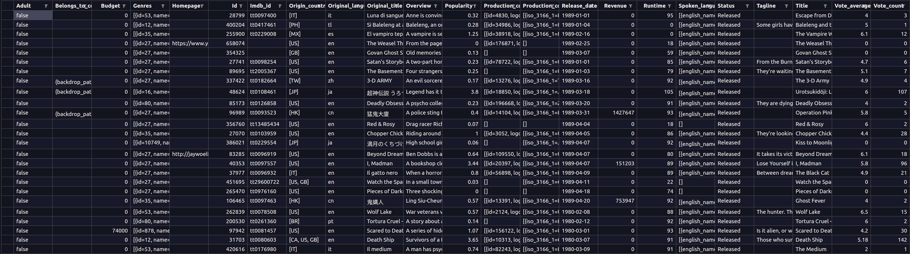

---

### Transformações

- **Remoção de colunas**


As colunas que serão removidas são:

**Adult**

Pois a informação é ambígua e todas as linhas extraídas da api estão como false.

**Homepage**

Coluna com link irrelevante na análise.

**Belongs to colection**

A coluna possui dois links e o nome da coleção que o filme pertence, acredito não ser importante parar a análise.

**IMDB id**

É uma coluna que poderia ser usada para trazer informações novas, mas agora se torna irrelevante.

---

**Explodindo Linhas de Listas**

**Genres**


```json
[
    {   
        id=27, 
        name="Horror"
    },
    {
        id=28, 
        name="Action"
    }
]
```

Queremos transformar essa linha em duas linhas somente com os nomes dos gêneros, para isso a lista de dicionarios é transformada em uma lista de strings somente com os nomes dos gêneros, depois usando o "explode()" criamos uma linha para cada gênero.

```python
df = df.withColumn("genres", expr("transform(genres, x -> x.name)"))

df = df.withColumn("genres", explode("genres"))
```

Para retirar somente o nome do array, uso higher-order functions, que permite lidar com array, aceitando funções como inputs, no caso do transform() ele mapeia os elementos do array, e pega somente os itens da chave "name".

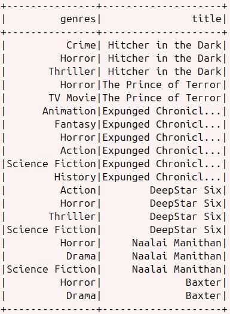

**Origin Country**

Utilizei o explode, pois era somente um array dos países.

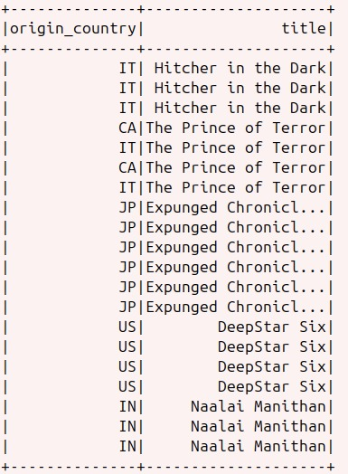

**Production Companies**

Essa coluna também era um array de dicionários, e a única informação necessária era nome das produtoras. Como poderia ter mais de uma fiz a criação do array e depois o explode().

```python
df = df.withColumn("production_companies", expr("transform(production_companies, x -> x.name)"))

df = df.withColumn("production_companies", explode("production_companies"))
```

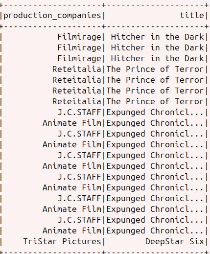

**Spoken Languages**

Essa coluna segue o mesmo das outras, resolvi usar o nome em inglês, já que muitas línguas não são compreensíveis, e algumas linhas não tinham os nomes originais.

```python
df = df.withColumn("spoken_languages", expr("transform(spoken_languages, x -> x.name)"))

df = df.withColumn("spoken_languages", explode("spoken_languages"))
```

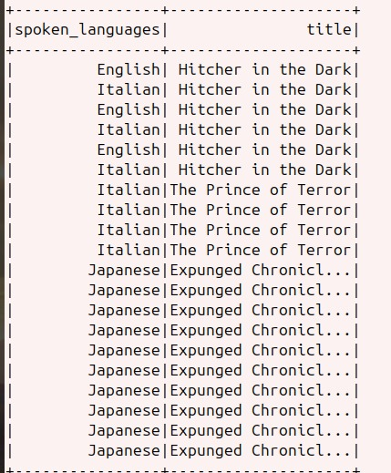

**Production Countries**

Nessa coluna fiz somente a explosão do conteúdo em lista, pois preciso da abreviação e do nome dos países, como estão relacionados deixei eles na mesma coluna


```python
df = df.withColumn("production_companies", explode("production_companies"))
```

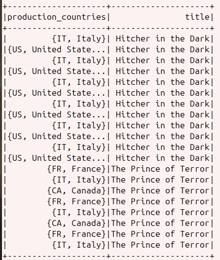

Tabela final:

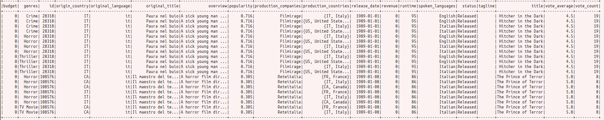

### Filtro

Ao longo da construção do modelo, percebi que muitos dados tinham informações incompletas, principalmente em relação à questão de orçamento e receita, que eram métricas importantes para a análise.

Com isso resolvi fazer um filtro em relação à presença desses dados, o filtro é para todas as linhas onde receita é maior que zero, pois apesar de não ser comum na época, pode sim ter existido filmes de terror que não receberam investimentos (budget). Claro que pode acontecer do filme ter algum investimento, mas não foi registrado, porém, vou considerar que nesse caso a quantia foi pequena ou inexistente. 

```python
df = df.where(col("revenue") > 1)
```

OBS: O filtro é aplicado no início do job, para evitar processamento de dados desnecessários.

### Construção do Modelo Dimensional

**Informações métricas**

Informações métricas, são valores quantitativos que podem ser contados, somado ou comparados, estão na tabela fato.

Analisando a tabela, defini as seguintes colunas métricas:

- id_filme
- budget
- revenue
- popularity
- runtime
- vote_avarage
- vote_count

**Informações Descritivas**

- genres
- origin_country
- production_countries
- original_language
- spoken_languages
- original_title
- overview
- production_companies
- release_date
- tagline
- title

**Construção do diagrama**

Com as colunas de informações descritivas e métricas definidas, comecei a construção do modelo.

Primeiramente contruí a tabela fato com as informações métricas, e depois para as descritivas fiz um agrupamento definindo as dimensões que cada informação iria ocupar, assim criando 6 dimensões:

- dim_tempo

- dim_genero

- dim_filme

- dim_linguagem

- dim_pais

- dim_produtora

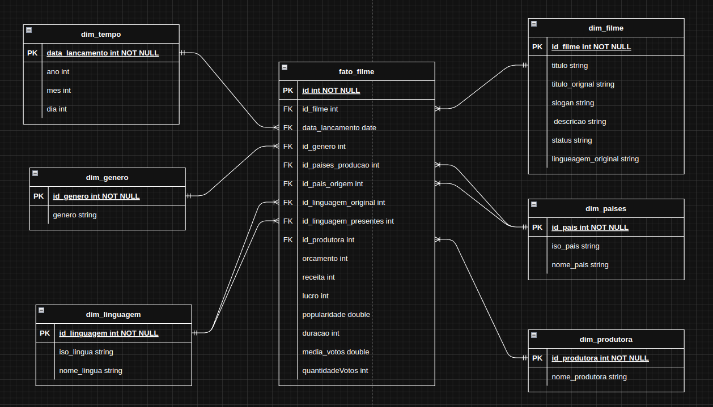


Considerações sobre o modelo:

- Varias colunas da tabela original oriunda do TMDB, tinha listas dentro de colunas, como países onde os filmes foram produzidos, há em alguns casos mais de um país, para resolver esse "problema", seria necessário fazer uma tabela intermediaria entre a fato e a dimensão países, porém, na minha visão isso aumentaria muito a complexidade, assim resolvi manter a redundância na fato.

- Resolvi fazer a tradução dos campos no modelo dimensional, para facilitar a análise posterior.

- As dimensões linguagem e pais, tem duas relações na tabela fato, isso porque o filme tem informações diferentes para os mesmos dados de países e línguas, na minha visão esse foi o melhor jeito de resolver esse problema, já que criação de tabelas intermediarias dificultaria a pesquisa dentro do modelo, porém não sei se isso pode gerar problemas no futuro.

### Criação das Tabelas no Script

Agora com o modelo dimensional pronto podemos começar a construção do script, e o primeiro passo é criar as dimensões.

#### dim_filme

Essa dimensão armazena todas as informações descritivas do filme. Foi fácil de montar, pois a chave primaria é próprio id do TMDB, então foi só selecionar as colunas para montar a dimensão. 

```python
dim_filme = df.select(
    "id" , 
    "status",
    col("title").alias("titulo"),
    col("original_title").alias("titulo_original"),
    col("tagline").alias("slogan"),
    col("overview").alias("descricao")
).dropDuplicates()
```

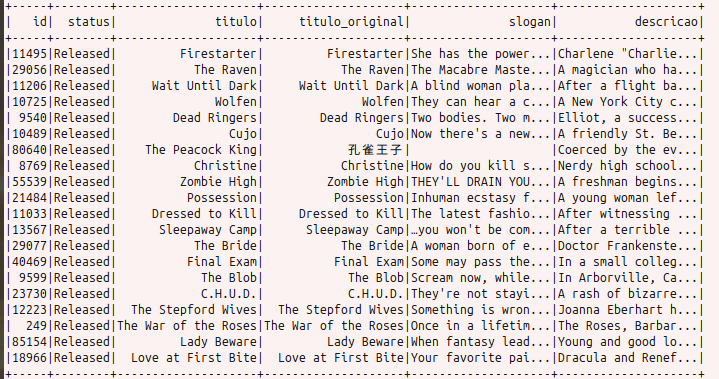

#### dim_tempo

Para dimensão tempo, usualmente existe tem uma chave inteira com todas as datas de um determinado período, porém como nesse dataframe não haverá adições de novos dados, utilizei a coluna release_date como chave para dimensão. Quanto ao conteúdo da tabela, separei os dados entre as colunas ano, mês e dia.

```python
dim_tempo = df.select(
    "release_date",
    year(col("release_date").alias("ano")),
    month(col("release_date").alias("mes")),
    day(col("release_date").alias("dia"))
).dropDuplicates()
```

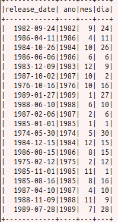

#### dim_genero

A dimensão gênero tem todos os gêneros do dataframe, diferente das tabelas acima, não havia nenhuma chave para a coluna, então criei chaves na dimensão para posteriormente relacionar na fato.

```python
dim_genero = df.select(
    col("genres").alias("genero")
).dropDuplicates()
dim_genero = dim_genero.withColumn("id_genero", monotonically_increasing_id())
```

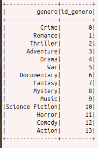

#### dim_produtora

A dimensão produtora, parecida com gênero, tem a coluna para o nome da produtora, e o id gerado para relacionamento na tabela fato

```python
dim_produtora = df.select(
    col("production_companies").alias("nome_produtora")
).dropDuplicates()
dim_produtora = dim_produtora.withColumn("id_produtora", monotonically_increasing_id())
```

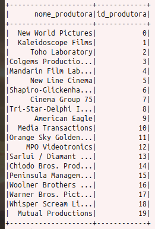

#### dim_paises

Na dimensão países, é armazenado o nome e a abreviação dos países. Como a coluna production_countries era em formato dict, usei o método "getField()" permite selecionar um campo dentro da coluna. Nessa tabela também gerei as chaves para relacionamento.

```python
dim_paises = df.select(
    col("production_countries").getField("name").alias("nome_pais"),
    col("production_countries").getField("iso_3166_1").alias("iso_pais"),
).dropDuplicates()
dim_paises = dim_paises.withColumn("id_pais", monotonically_increasing_id())
```

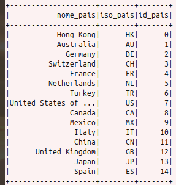


#### dim_linguagem 

A dimensão linguagem é bem parecida com dimensão países, tem nome e abreviação, e estão no formato dict. Então criei uma tabela parecida com países, com as duas colunas descritivas, e as chaves geradas para o relacionamento na fato.

```python
dim_linguagem = df.select(
    col("spoken_languages").getField("iso_639_1").alias("iso_linguagem"),
    col("spoken_languages").getField("english_name").alias("nome_lingua_en")
).dropDuplicates()
dim_linguagem = dim_linguagem.withColumn("id_linguagem", monotonically_increasing_id())
```

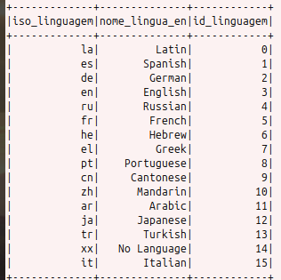

### Tabela fato

A tabela fato armazena todos os ids para as dimensões, e as informações métricas.

Para criar a tabela fato, seleciono todas as informações métricas e algumas informações descritivas, para poder criar a coluna com os ids das dimensões.

```python
fato_filme = df.select(
    col("id").alias("id_filme"),
    col("release_date").alias("data_lancamento"),
    col("budget").alias("orcamento"),
    col("revenue").alias("receita"),
    col("popularity").alias("popularidade"),
    col("runtime").alias("duracao"),
    col("vote_average").alias("media_votos"),
    col("vote_count").alias("quantidade_votos"),
    "genres",
    "production_companies",
    "origin_country",
    "original_language",
    "production_countries",
    "spoken_languages"
).dropDuplicates()
```

#### Join entre Dimensões

Para criar as colunas com ids, faço join com as colunas descritivas e deixo somente a coluna que faz referência as dimensões.

```python
fato_filme = fato_filme.join(
    dim_genero, 
    fato_filme.genres == dim_genero.genero, 
    "inner"
).drop("genres", "genero")
```


##### Tabela fato:

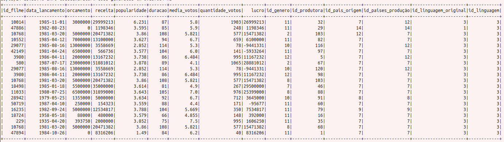

[Script](./jobRef.py)

### Rodando no Glue

Para rodar o script no glue, basta:

- Passar o caminho do arquivo-fonte no bucket (camada trusted)
- Passar o caminho de escrita do modelo dimensional (camada refined)
- Configurar o Job

**Script no Glue:**
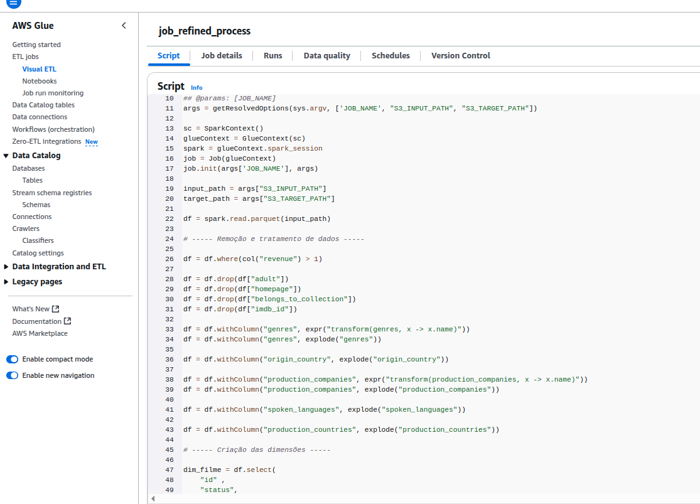

Depois do script rodar, fiz um crawler para identificar as tabelas no Glue catalog. Segue a imagem das tabelas no Athena.

**Tabelas no Athena:**
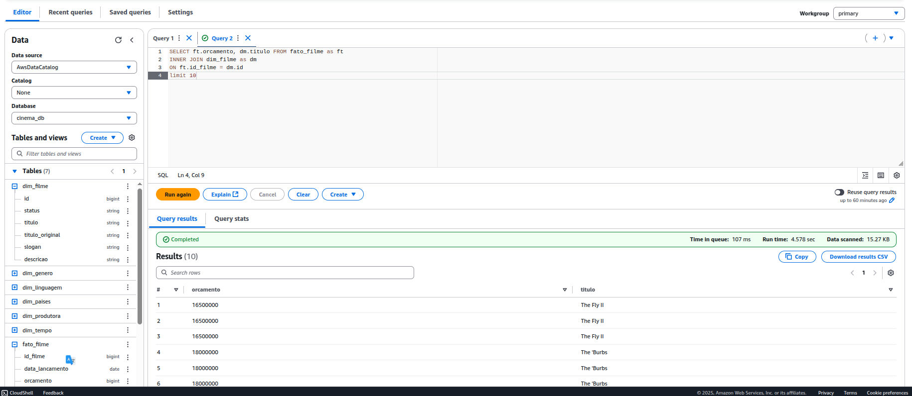

