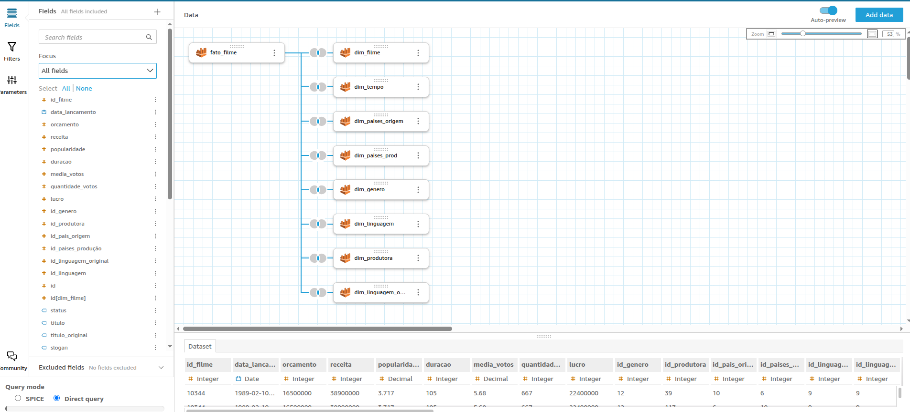
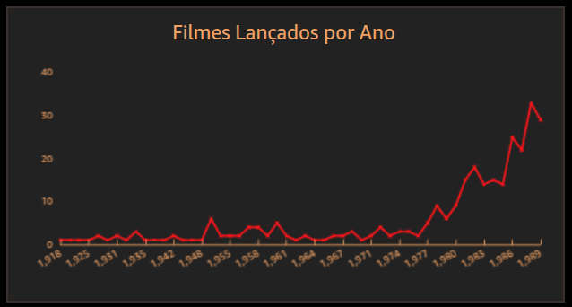
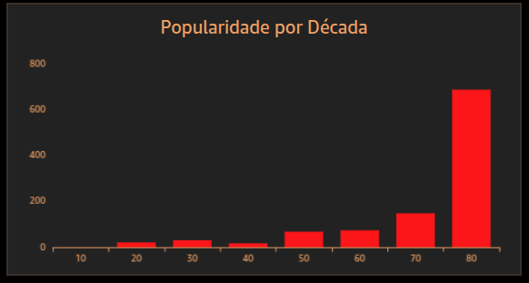
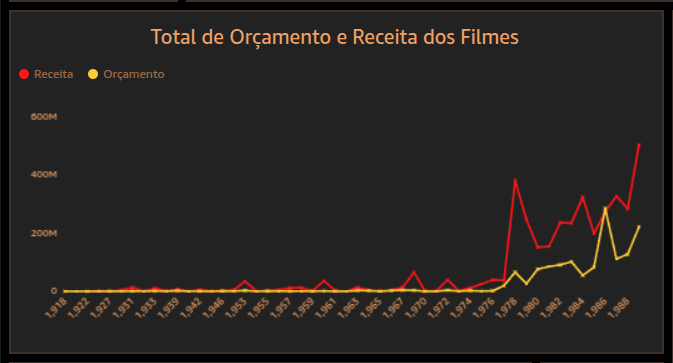
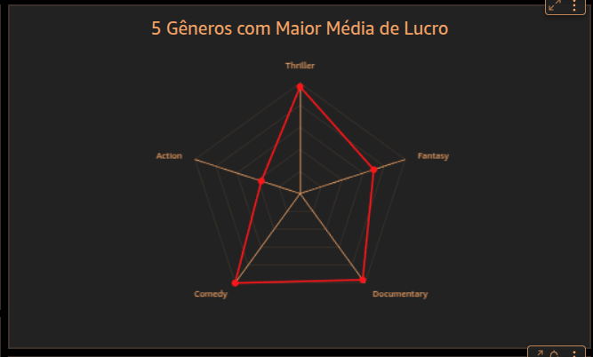
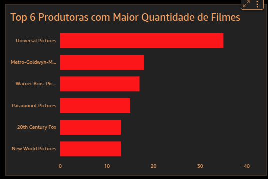
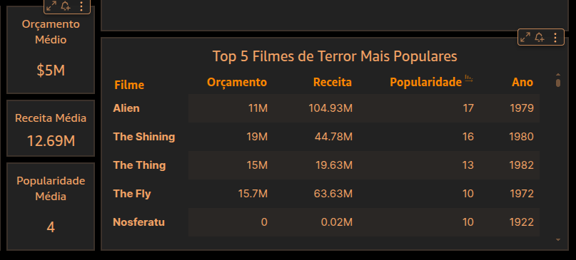
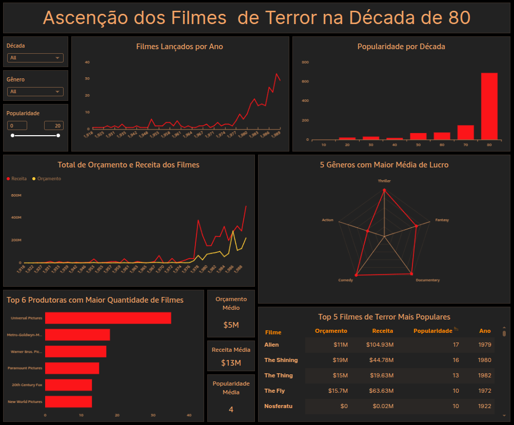

# 🎯 Desafio Sprint 8

Desafio da Sprint 8 é a parte final dos desafios, nela o nosso objetivo era gerar insights a partir dos dados coletados, construindo um dashboard para tentar responder a nossa questão elaborada na Sprint 5.

## Desenvolvimento

---

### Disponibilização dos dados

Para desenvolver meu dashboard precisava dos dados do modelo dimensional. No QuickSight, importei do Athena todas as tabelas do modelo dimensional e montei os joins.

#### Modificações:

- Na tabela gênero removi a linha "Horror", pois a própria análise é de filmes de terror, então esse gênero estava atrelado a todos os filmes, não fazia muito sentido ter essa informação.

- No job do glue onde construo o modelo, criei a coluna década, para facilitar a criação e o entendimento dos dados, principalmente em gráficos de barras.

- Para os dados métricos da tabela fato, utilizei campos calculados pois na minha modelagem, essa tabela possuia redundância, oque causava erro na soma de valores principalmente de orçamento e receita.

### Storytelling

#### Houve uma ascensão dos filmes de terror nos anos 80?

Um dos erros da minha análise morava na pergunta, "Como se deu a evolução da popularidade dos filmes de terror até a década de 80?", porém não existia uma certeza dessa ascensão, a informação é que tinha filmes bons na década de 80, mas não um estudo que comprovava a ascensão, então mudei o escopo da pergunta, e com ela um adendo "Se houve uma ascensão porque aconteceu?".

#### Perguntas:

##### Houve ascensão?

- O número de filmes terror aumentou ao longo do tempo?

- Popularidade aumentou ao longo das décadas?

- Faturamento dos filmes de terror cresceu na década de 80?

##### Por que aconteceu?

- Quais subgêneros cresceram na década de 80?

- Quais filmes se destacaram nessa década?(popularidade, receita)

- Produtoras que mais lançaram filmes na década de 80?

#### História

A ideia do dashboard é explicar visualmente utilizando os primeiros gráficos, se houve realmente um crescimento dos filmes de terror nos anos 80, e depois ir mostrando possíveis motivos para tal.

### Contrução de gráficos

Minha análise consiste em uma exploração dos dados, tentar encontrar tendencias e fatores que influenciaram nessa ascensão, nesse caso os gráficos de barras e de linha vão ser mais utilizados.

#### Tema

Utilizei um tema escuro com vermelho e um laranja fraco, os dashboard geralmente são claros, porém como o tema é terror acho que um tom mais sombrio combinaria.

#### Gráficos

- **Filmes lançados por ano**:

    Esse é o gráfico inicial e o mais básico vai mostrar o crescimento de filmes ao longo dos anos, oque queremos ver é claro, se houve um aumento na produção de filmes na década de 80:

- **Colunas**
    Ano - X
    Filme(count distinct) - Valor

- **Popularidade por década**:

    Assim como a quantidade filmes, a popularidade dos filmes tem que aumentar ao longo do tempo:

- **Colunas**
    Década - X
    Popularidade(sum) - Valor

- **Total de orçamento e Receita dos filmes**:

    O último gráfico para comprovar a Ascensão, seria obviamente o de orçamento e lucro, se o gênero de terror começou a ter sucesso, as empresas provavelmente investiram mais nas produções.

- **Dados**
    Ano - X
    Orçamento(sum) - Value
    Receita(sum) - Value

- **5 gêneros com maior lucro**:

    Agora que temos a prova de uma ascensão, começamos a investigar o porquê. Primeiro gráfico é referente aos subgêneros, lucro é uma boa estimativa par descobrir subgêneros de sucesso, talvez uma mudança de estilo dos filmes de terror tenha aumentado a lucratividade.

- **Dados**
    Gênero - X
    lucro(avarage) - Value

- **Produtoras com maior Quantidade de lucro**:

    Esse gráfico ajudará a entender qual produtora teve maior participação na alavancagem do gênero.

- **Dados**
    Nome da Produtoraf - Y
    Filme(count distinct) - Value

- **Tabela top 5 filmes de terror mais populares / KPI**

    Aqui coloco uma tabela para ver quais filmes de terror são os mais populares, com informações importantes como receita, popularidade e ano de lançamento, assim podemos ver se alguns filmes se destacam e possam ter causado o início dessa ascensão. 

    Ao lado da tabela coloquei alguns KPI's para indicar a média dos valores gerais, isso ajuda a compreender se o valor é discrepante do restante dos dados.

**Dashbord:**

### Interpretações

Mais do que criar um dashboard bonito, é notar alguns insights.

- **Ascensão:**

    Claramente os Filmes de terror tiveram uma ascensão não somente na quantidade de filmes, mas como na sua popularidade.

- **Investimentos e Retorno**
    
    O gráfico de orçamento e retorno mostra que nos momentos onde houve investimento nos filmes te terror, o mercado respondeu bem com grandes bilheterias.

- **Diversificação de Subgêneros**

    Quando se análise os dados, pDashbord:**e ação e intensidade dos filmes, antes dos anos 70 gêneros são mais "parados" e usando de um terror mais psicológico.

- **Produtoras**

    Quando se observa as produtoras, podemos ver que grandes estúdios tiveram importante papel na consolidação do gênero. Isso pode ter ajudado a criar grandes franquias, e um trabalho de marketing que impulsionou o gênero.

## Colclusão

Com base nas informações que analisamos, podemos perceber que o gênero de terror ganhou um espaço grande no cinema, especialmente durante as décadas de 70 e 80. Toda essa mudança, aconteceu porque os filmes passaram por uma transformação em seu formato, que cativou o público e gerou um grande engajamento. Essa popularização atraiu o interesse das empresas, que passaram a investir cada vez mais nos filmes de terror, contribuindo para o sucesso e a consolidação do gênero no cinema.

O crescimento dos filmes de terror mostra que sair da zona de conforto e apostar em ideias diferentes pode trazer muito sucesso. O gênero, que antes não tinha muito valor, com poucos títulos e sucessos, ganhou força justamente quando se reinventou e experimentou novos jeitos de criar suas obras. Isso mostra que arriscar e pensar fora da caixa pode transformar um cenário inteiro, e no caso dos filmes de terror, criar títulos clássicos que até hoje são lembrados e reconhecidos no cinema.