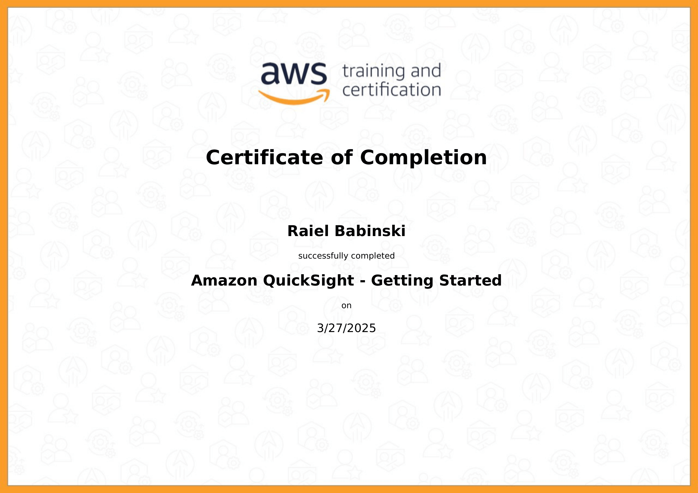

#  🏆 **Sprint 8**  🏆

## 📚 **Conteúdos**

### Complete Introduction to Amazon QuickSight

O curso é uma introdução a todas as feramentas do QuickSight, explicando como montar todos os tipos de gráfico, e fazer filtragem e pesonalização dos dados para a análise.

### 🎯 [ Desafio ](./Desafio/README.md)

---

## 🎓 **Certificados**  

---

